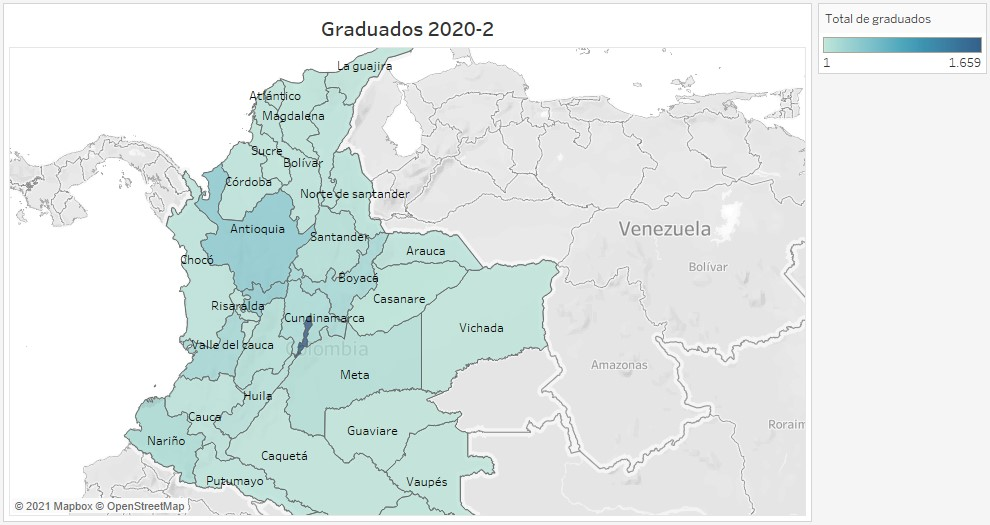

# Partes principales de un gráfico

```{r message=FALSE, warning=FALSE, include=FALSE}
library(UnalR)
library(UnalData)
library(dplyr)
library(ggplot2)
library(hrbrthemes)
library(readxl)
library(gapminder)
library(stringr)
library(R.utils)
```

A la hora de crear un gráfico es necesario tener presente cada uno de los elementos que lo conforman y determinar cual es la mejor manera de representar cada uno de estos para lograr el impacto deseado en la visualización. El diseño correcto de estos elementos garantizara el éxito de su gráfico, al comunicar de manera acertada la información que pretende presentar. Dentro de la gama de gráficos estadísticos básicos se identifican tres elementos importantes los cuales son ejes, geometría en la cual se incluyen la forma, tamaño y color, tipos de líneas y texto el cual incluye las etiquetas de los ejes, titulo y leyenda.

```{r partesgrafico-fig, echo=FALSE, fig.align='center', fig.asp=.75, fig.cap='Principales partes de un gráfico', out.width='100%'}
knitr::include_graphics("Imágenes/partesdelgrafico.jpg")
```

La figura \@ref(fig:partesgrafico-fig) presenta estos elementos importantes. En los recuadros negros se encierra todo lo relacionado con texto, etiquetas de los ejes, título y leyenda; las líneas naranjadas representan los ejes del gráfico de manera horizontal corre el eje X y de manera vertical el eje Y. En la parte central de la visualización se ubican las observaciones a las cuales se les aplica la geometría, dependiendo del tipo de gráfico es posible cambiar el tamaño, forma y color de cado dato.

A continuación, se presentan las características que se consideraron más importantes para tener en cuenta a la hora de dar formato y personalizar cada uno de los elementos mencionados.

## Ejes

Los ejes son de los elementos de mayor relevancia dentro de cada gráfico ya que determina la posición donde se ubica cada dato. Cuando se trata de gráficos en dos dimensiones, los más comunes, las posiciones son descritas a través de dos valores que especifican un punto de forma única, y por lo tanto se necesitan escalas de posición, estas escalas son generalmente los ejes X y Y. Por convención general el eje X corre horizontalmente y el eje Y lo hace de manera vertical, aunque esto no siempre debe ser así, hay gráficos en los cuales los ejes son radiales.
El objetivo principal de las visualizaciones que se crean es comparar los datos, es decir, identificar el comportamiento de cada observación en relación con las demás que posee el conjunto de datos. Para realizar estas comparaciones es importante definir la escala de los ejes de manera adecuada, una mala elección de estas escalas lo puede conducir a interpretar la información de manera errada; es recomendable iniciar los ejes en 0, aunque no siempre es necesario si es importante considerar que los datos sean comparables.

Para ilustrar la importancia de la correcta elección del inicio del eje Y consideremos la visualización de cantidades a lo largo de una escala lineal. La figura \@ref(fig:usoincorrectoejey-fig) muestra las ventas en cinco estados de EE.UU; una vista rápida a esta visualización indica que las ventas en North Dakota son extremadamente bajas en comparación con los demás estados, sin embargo, este gráfico es engañoso ya que las ventas inician en $\$900$ USD, por lo tanto, mientras que el punto final de cada barra indica de manera correcta el total de ventas, la altura de la barra representa la medida en que las ventas superan los $\$900$ dólares; la percepción humana entenderá la altura de cada barra como las ventas por estado lo que conlleva a una interpretación errónea.


```{r usoincorrectoejey-fig, echo=FALSE, fig.align='center', fig.asp=.75, fig.cap='Ventas por estados de EE.UU, visualiazción engañosa', out.width='80%'}
Sample <- read_excel("Datos/Sample - Superstore.xls")
filtrar <- Sample %>% filter(State %in% c("North Dakota", "West Virginia", 
                                          "Maine", "South Dakota", "Wyoming"))
ggplot(filtrar, aes(x = State, y = Sales)) + 
  geom_bar(stat = "identity", fill = "skyblue") +
  coord_cartesian(ylim = c(900, 1700)) +
  labs(y = "Sales USD", 
       title = "Sales by states in USA")
```

La forma correcta de visualizar estos datos se presenta en la figura \@ref(fig:usocorrectoejeyinicio0-fig), es claro que existen diferencias entre las ventas por estados, pero no son tan distantes como lo muestra la figura \@ref(fig:usoincorrectoejey-fig), las ventas en los cinco estados presentados son comparables. En este caso es particular se debe seguir la regla de iniciar los ejes en cero.   

```{r usocorrectoejeyinicio0-fig, echo=FALSE, fig.align='center', fig.asp=.75, fig.cap='Ventas por estados de EE.UU, uso correcto de la escala lineal', out.width='80%'}
ggplot(filtrar, aes(x = State, y = Sales)) + 
  geom_bar(stat = "identity", fill = "skyblue") +
  coord_cartesian(ylim = c(0, 1700)) +
  labs(y = "Sales USD", 
       title = "Sales by states in USA")
```

## Geometría

La geometría es una parte primordial y que hará las visualizaciones mucho mas claras y entendibles. Dentro de las geometrías principales podemos considerar la forma, tamaño, tipo de línea y color.

### Forma y tipo de línea

Estas dos son estéticas o atributos que generalmente se usan para representar datos categóricos, dentro de visualizaciones discretas o continuas. Cuando se trata de gráficos de dispersión se opta por usar diferentes formas a partir de una variable categórica con el fin de comparar los comportamientos de cada uno de los valores que toma la variable cualitativa. En el caso de los gráficos de líneas se opta por usar diferentes estilos o tipos de líneas nuevamente con el fin de diferenciar la categoría de los datos, por lo general los estilos usados son líneas continuadas y punteadas. Ambos elementos pueden ser usados para distinguir o resaltar, en el caso de ser usados para distinguir se asigna una forma o tipo de línea a cada uno de los niveles de la variable categórica y en el caso de resaltado se usa la misma forma o tipo de línea para todos los datos excepto para aquellos elementos que queremos resaltar.

La figura \@ref(fig:formasparadistinguir-fig) ilustra el uso de distintas formas para distinguir las especies de flores registradas en la base de datos Iris. Como ya se menciono se usan tantas formas como niveles tenga la variable categórica, en este caso se usan círculos, triángulos y cuadrados.

```{r formasparadistinguir-fig, echo=FALSE, fig.align='center', fig.asp=.75, fig.cap='Uso de las formas para distinguir grupos de datos', out.width='80%'}
ggplot(iris, aes(x=Sepal.Length, y=Sepal.Width, shape=Species)) + 
  geom_point(size=2) +
  labs(x = "Sepal Lenght", y = "Sepal Width", 
       title = "Sepal Lenght vs Sepal Width by species")
```

Si quisiéramos resaltar una de las especies por ejemplo, Visicolor debemos asignar la misma forma a las especies Setosa y Virginica y una distinta a la especie a resaltar, por ejemplo usar círculos y triángulos, como se presenta en la figura \@ref(fig:formaspararesaltar-fig).

```{r formaspararesaltar-fig, echo=FALSE, fig.align='center', fig.asp=.75, fig.cap='Uso de las formas para resaltar un grupo de observaciones', out.width='80%'}
ggplot(iris, aes(x=Sepal.Length, y=Sepal.Width)) + 
  geom_point(aes(shape = Species), size = 3) +
  scale_shape_manual(values = c(19, 17, 19)) +
  labs(x = "Sepal Lenght", y = "Sepal Width", 
       title = "Sepal Lenght vs Sepal Width by species")
```

### Tamaño 

El tamaño generalmente es una estética usada en gráficos de dispersión, se incluye una nueva variable continua o discreta que determina el tamaño de cada observación representada en el gráfico. Este atributo es de gran utilidad, pero se debe tener mucho cuidado al usarlo, ya que en el caso de datos desproporcionados un solo punto ocupará un tamaño exagerado que será poco comparable con los demás datos.

La figura \@ref(fig:usotamanodiscreto-fig) ilustra el uso de una variable discreta para asignar diferentes tamaños a las observaciones.

```{r usotamanodiscreto-fig, echo=FALSE, fig.align='center', fig.asp=.75, fig.cap='Asignación de tamaños mediante una variable discreta', message=FALSE, warning=FALSE, out.width='80%'}
ggplot(iris, aes(x=Sepal.Length, y=Sepal.Width, size = Species, color = Species)) + 
  geom_point() + 
  labs(x = "Sepal Lenght", y = "Sepal Width", 
       title = "Sepal Lenght vs Sepal Width by species")
```

La figura \@ref(fig:usotamanocontinuo-fig) muestra el uso de una variable continua para determinar el tamaño de cada observación, note que a demás de la geometría relacionada al tamaño se debe usar la transparencia para evitar que los países con mayor población oculten o se sobrepongan a aquellos a países de menor población.

```{r usotamanocontinuo-fig, echo=FALSE, fig.align='center', fig.asp=.75, fig.cap='Asignación de tamaños mediante una variable continua', out.width='80%'}
data <- gapminder %>% filter(year=="2007") %>% dplyr::select(-year)
data %>%
  arrange(desc(pop)) %>%
  mutate(country = factor(country, country)) %>%
  ggplot(aes(x=gdpPercap, y=lifeExp, size = pop)) +
  geom_point(alpha=0.5) +
  scale_size(range = c(.1, 24)) + 
  theme(legend.position = 'none') +
  labs(title = "GDP per capita and life expectancy")
```

### Color

El color es una de las estéticas más importantes y que pueden marcar una gran diferencia en la interpretación de sus datos. Existen algunos colores que destacan más que otros por lo que darán un peso innecesario a los datos, es decir, que atraen la atención de los usuarios a esos puntos y que pueden no necesariamente ser los de interés central, también es recomendable no superar los seis colores por gráfico. El color dentro de una visualización puede ser usado principalmente para tres casos: para distinguir grupos de datos entre sí, uso del color para representar valores de datos y finalmente puede ser usado para resaltar.

#### Distinguir grupos de datos

Emplear el color como una herramienta para distinguir es uno de los usos más comunes que se le da al color cuando se trata de gráficos que incluyen variables categóricas y que no tienen un orden específico como diferentes niveles de formación dentro de una universidad o departamentos dentro de un mapa. En este caso, se utiliza una escala de colores cualitativa la cual contiene un conjunto finito de colores específicos que se eligen para versen claramente distintos entre sí y que al mismo tiempo deben ser equivalentes entre sí. Es decir que lo colores seleccionados se deben poder diferenciar de manera clara y precisa, pero uno no debe resaltar más que otro. También es importante que el conjunto de colores seleccionados no presente un orden ya que esto creara un orden en la visualización que por definición de los datos no se tiene. Como recomendación general, las escalas de color cualitativas funcionan mejor cuando hay de tres a cinco categorías diferentes; tener ocho o diez categorías hará que la tarea de hacer coincidir los colores sea tediosa, a demás la leyenda será demasiado extensa y el usuario tendrá que hacer un fuerte trabajo de búsqueda para identificar el color correspondiente a cada categoría; en el caso de muchas categorías se recomienda usar etiquetas directas sobre la observación para así facilitar la comprensión del gráfico aunque con esto también se debe tener cuidado ya que muchas etiquetas hará que la visualización se sature y la información no sea transmitida de la manera correcta.

La figura \@ref(fig:usocolordistinguir-fig) muestra el uso correcto de los colores como herramienta para distinguir, se seleccionaron colores que contrastan entre sí pero no compiten por la atención, este gráfico en particular posee ocho categorías distintas pero aún así se logra identificar claramente cada una de las sedes de admisión.

```{r usocolordistinguir-fig,echo=FALSE, fig.align='center', fig.asp=.75, fig.cap='Uso del color como herramienta para distinguir grupos de datos', message=FALSE, warning=FALSE, out.width='100%'}
graduados <- Graduados %>% 
  mutate(YEAR_SEMESTER = paste(YEAR, SEMESTRE, sep = " - ")) %>% 
  group_by(YEAR_SEMESTER, SEDE_NOMBRE_ADM) %>% 
  count()
ggplot(data = graduados, aes(x = YEAR_SEMESTER, y = n, group = SEDE_NOMBRE_ADM,
                             colour = SEDE_NOMBRE_ADM)) +
  geom_line(size  = 1) + 
  geom_point(size = 2) +
  scale_colour_manual(values = c("#29ABE2", # AZUL CLARO  | Amazonia
                               "#8CC63F", # VERDE       | Bogota
                               "#CC241D", # ROJO        | Caribe
                               "#0071BC", # AZUL VIVO   | Manizales
                               "#F15A24", # NARANJA     | Medellin
                               "#FBB03B", # AMARILLO    | Orinoquia
                               "#93278F" # MORADO      | Palmira
                               )) +
  theme(panel.background = element_rect(fill = "#ecf0f1"),
  panel.grid.minor = element_line(linetype = "dotted"),
  axis.text.x = element_text(angle = 45, hjust = 1),
  legend.position = 'bottom',
  plot.title = element_text(hjust = 0.5)) +
  labs(x = "Periodo", y = "Número de graduados",
       title = "Evolución del número de graduados por sede",
       colour = "")
```

#### Representar valores

El color también puede ser usado como herramienta para representar variables cuantitativas como ingresos, temperatura, entre otros. En este caso se usa una escala de color secuencial, la cual indica claramente que valores son más grandes o pequeños y que tan distantes se encuentran dos valores específicos entre sí. Estas escalas secuenciales de color pueden basarse en un solo tono por ejemplo de azul oscuro a azul claro, o en múltiples matices por ejemplo de rojo oscuro a amarillo claro.

En la figura \@ref(fig:usocolorrepresentar-fig) presenta un uso adecuado de la escala de colores secuencial, se usa una paleta de un solo tono que inicia en azul claro y termina en un azul un poco más fuerte. Esta visualización presenta la cantidad de estudiantes graduados en el periodo 2020-II por departamento de nacimiento y la escala de color fue usada para colorear el conteo por cada uno de estos departamentos.

```{r usocolorrepresentar-fig, echo=FALSE, fig.align='center', fig.asp=.75, fig.cap='Uso de la escala de color secuencial para representar valores', out.width='100%'}

```

Existen algunas ocasiones en las cuales es necesario visualizar la desviación de los valores de los datos en una de dos direcciones en relación con un punto medio neutral. Un ejemplo sencillo y muy básico de estos casos es cuando se tienen números positivos y negativos, que se representan por dos colores, puede ser verde para los números positivos y rojo para los negativos, a partir de la intensidad de estos colores se indica la lejanía con el cero. La escala de color usada en estos casos se denomina divergente y puede pensarse como dos escalas de colores secuenciales que se unen en un punto medio; estas escalas deben ser equilibradas, de modo que la progresión de los colores claros en el centro a los colores oscuros del exterior debe ser la aproximadamente igual para ambas direcciones.

```{r escaladivergente-fig,echo=FALSE, fig.align='center', fig.asp=.75, fig.cap='Escala divergente para representar valores', out.width='100%'}
knitr::include_graphics("Imágenes/escaladivergente.jpg")
```

La figura \@ref(fig:escaladivergente-fig) presenta una de los tantos usos que se le puede dar a las escalas de colores divergentes, se presenta los beneficios por estados. Es importante notar que la escala de colores no se encuentra equilibrada y esto se debe a la desproporción de los datos, a pesar de esto la visualización sigue siendo informativa y se logra distinción entre los colores.

#### Resaltar observaciones

Emplear el color para resaltar observaciones es de gran utilidad cuando el conjunto de datos contiene información clave sobre la historia que se quiere contar a través del gráfico y enfatizar en estos elementos conlleva a una mejor comprensión de la información que se desea comunicar. Para lograr este énfasis podemos colorear estos elementos de la figura con colores o tonalidades que se destaquen vívidamente contra el resto de la figura; generalmente se usan escalas de color de acento, las cuales contienen tanto un conjunto de colores tenues como un conjunto coincidente de colores más fuertes.

Cuando se trabaja con una escala de color de acento, es fundamental que los colores básicos no compitan por la atención. Estos colores de base deben ser monótonos pero que apoye bien el color de acento, es muy común cometer el error de usar colores de línea de base que son demasiado coloridos, de modo que terminan compitiendo por la atención del lector. Una alternativa fácil es usar un color neutro en todos los elementos de la figura, excepto para la categoría de puntos que se quiere resaltar.

La figura \@ref(fig:resaltardatos-fig) muestra el total de estudiantes admitidos por departamento de nacimiento, se hace uso de una escala de color de acento para resaltar los departamentos pertenecientes a la región andina. Observe que se usa un color neutro para los departamentos que no son de interés y un color azul llamativo para atraer la atención del usuario a la región andina. Esta figura presenta uno de los tantos usos que se le puede dar a las escalas de colores de acento para resaltar datos, es posible aplicarla a gráficos de líneas, diagramas de dispersión, entre otros.

```{r resaltardatos-fig, echo=FALSE, fig.align='center', fig.asp=.75, fig.cap='Escala de color de acento para resaltar observaciones', out.width='80%'}
Aspirantes <- UnalData::Aspirantes
Admitidos <- Aspirantes %>% filter(ADMITIDO == 'Sí', YEAR == '2020', SEMESTRE == 2, DEP_NAC != "NA") %>% 
  mutate(DEP_NAC = str_replace(DEP_NAC, 
                               'ARCHIPIÉLAGO DE SAN ANDRÉS, PROVIDENCIA Y( SANTA CATALINA)?', 
                               'SAN ANDRÉS'))
Admitidos$DEP_NAC <- str_replace(Admitidos$DEP_NAC, 'DEPARTAMENTO EXTRANJERO', 'DPTO EXTRANJERO')
Admitidos$DEP_NAC <- str_to_title(str_to_lower(Admitidos$DEP_NAC))

deptosnac <- Admitidos %>% group_by(DEP_NAC) %>% count()

Regiones <- read.csv("Datos/Regiones_colombia.csv", sep = ";", header = TRUE)
deptos_region <- left_join(Regiones, deptosnac, 
                        by = c("Departamento" = "DEP_NAC"))

ggplot(data=deptos_region, 
       aes(x=reorder(Departamento, n), 
           y=n, 
           fill = Region)) + 
  geom_bar(stat="identity", position="dodge") +
  coord_flip() + 
  labs(y = "Número de estudiantes admitidos", 
       x = "Departamento de nacimiento", 
       title = "Distribución de estudiantes admitidos por departamento") +
  scale_y_continuous(breaks=seq(0, 3000, 500)) +
  scale_fill_manual(values = c("cornsilk3", "#29abe2", "cornsilk3" , 
                               "cornsilk3", "cornsilk3")) +
  theme(plot.title = element_text(hjust = 0.5)) 

```

## Texto

Al momento de realizar una visualización el texto es uno de los elementos a los cuales se les presta poca atención pero que podrían hacer el gráfico aún mas informativo, se debe manejar una misma fuente pero proporcionar un balance entre los tamaños con el fin de destacar los elementos importantes, por ejemplo, el título de la visualización debe atraer más la atención del usuario que las etiquetas del eje por esta razón no es correcto utilizar un tamaño mayor para las etiquetas del eje que para el título. El éxito de la estética de este elemento se basa en establecer correctamente la jerarquía que existe entre los textos que involucra el gráfico.

El objetivo principal de una visualización es informar y transmitir información de manera clara y concisa, por esta razón se deben colocar los datos en contexto proporcionando títulos, subtítulos y otras anotaciones que los acompañen. A continuación, analizaremos algunas recomendaciones utiles que nos ayudarán a contextualizar los datos de manera correcta.

Uno de los elementos principales dentro de un gráfico es su título, este debe ser claro e informativo ya que su función es transmitir con precisión al lector de qué se trata la figura, también existen ocasiones en las que es necesario usar subtítulos para contextualizar por completo al usuario acerca de la información que se presenta. Otro elemento importante y que logra que las visualizaciones se expliquen por sí mismas son los títulos de los ejes, estos deben indicar de manera clara lo que representan y la unidad en que se miden, observe la figura \@ref(fig:usocorrectoejeyinicio0-fig) en la cual el eje Y esta titulado de manera correcta ya que indica que representa las ventas y esta medido en dólares; los títulos de las leyendas también deben ser claros e indicar lo que representan como se muestra en la figura \@ref(fig:resaltardatos-fig), donde el título de la leyenda hace referencia a la región geográfica del país, en algunas ocasiones es posible omitir el título de los ejes o de las leyendas, es decir, cuando las etiquetas son completamnete explícitas.

La figura \@ref(fig:usoincorrectotextos-fig) ilustra lo que no se debe hacer en una visualización ya que se le da enfoque princical a las etiquetas del eje y leyenda y no al título de la figura, el cual informa acerca de la visualización.


La figura \@ref(fig:manejotextos-fig) presenta la clara jerarquía existente entre los textos del gráfico, observe que se trabaja con la misma fuente pero se juega con mayúsculas y minúsculas para dar la importancia que cada elemento requiere, esta visualización es un ejemplo en el cual se puede omitir el título de la leyenda, ya que las etiquetas son tan claras que usar un título conlleva a un gráfico saturado. 

```{r manejotextos-fig, echo=FALSE, fig.align='center', fig.asp=.75, fig.cap='Uso correcto del texto para contextualizar', out.width='90%'}
Aspirantes <- UnalData::Aspirantes
sexo_admitidos <- Aspirantes %>% 
  filter(ADMITIDO == 'Sí', YEAR == '2021', SEMESTRE == 1) %>% 
  group_by(SEXO) %>% 
  summarise(CANTIDAD = n()) %>% 
  transmute(SEXO, PORCENTAJE = paste(round((CANTIDAD/sum(CANTIDAD))*100, 2), 
                                        "%", sep = ""))

ggplot(sexo_admitidos,aes(x = "", y = PORCENTAJE, fill = SEXO))+
  geom_bar(stat = "identity", color = "black")+
  geom_text(aes(label = PORCENTAJE),
            position = position_stack(vjust = 0.5), color="Black", size = 4)+
  coord_polar(theta = "y") +
  scale_fill_manual(values=c("#f26532", "#8cc63f"), 
                    name = "")+
  theme_void()+
  theme(legend.position = 'bottom',
        plot.title = element_text(hjust = 0.5)) +
  labs(title="DISTRIBUCIÓN DE ESTUDIANTES ADMITIDOS POR SEXO, PERIODO 2021-1")
```

