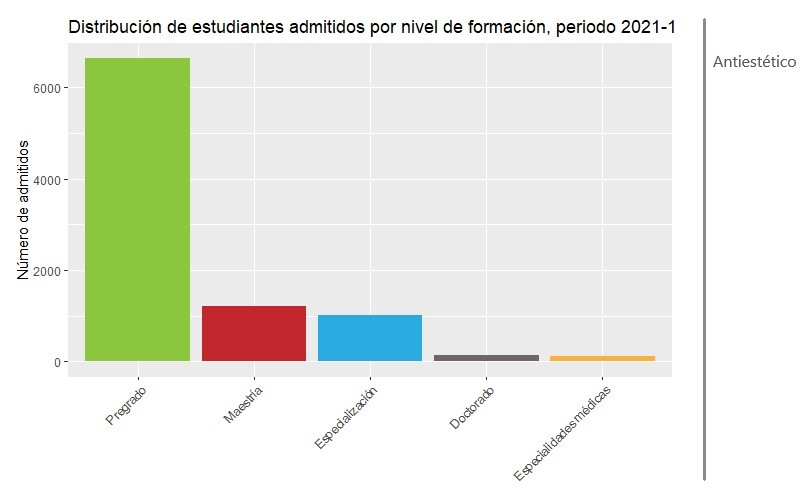
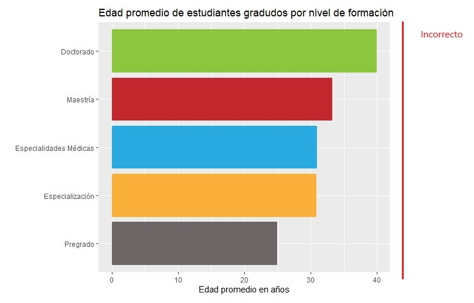
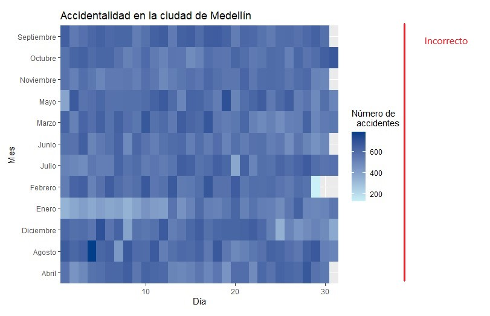
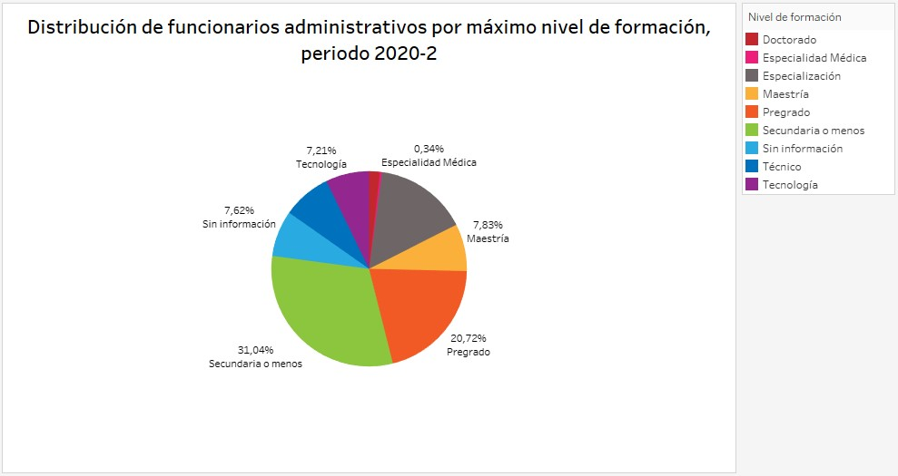
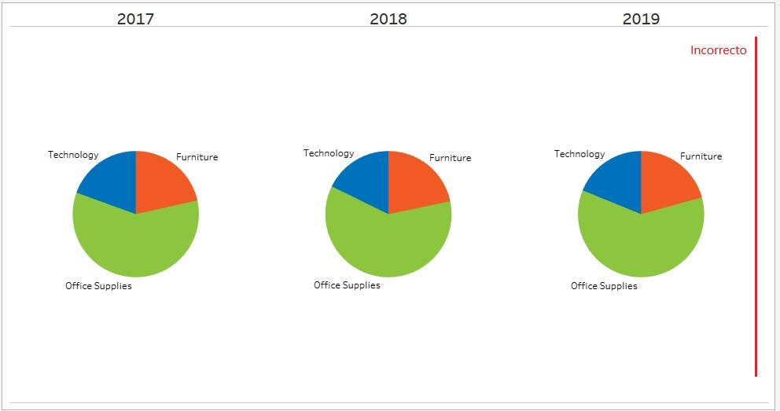
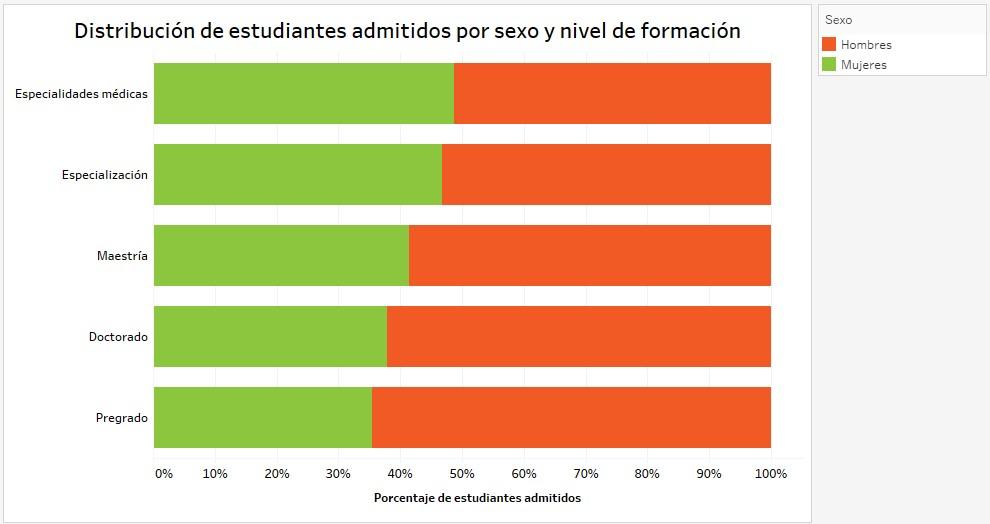
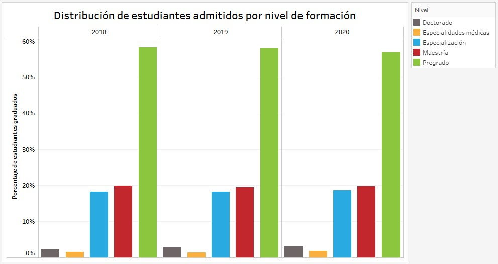

# ¿Cómo visualizar los datos? 

```{r message=FALSE, warning=FALSE, include=FALSE}
library(UnalData)
library(dplyr)
library(ggplot2)
library(stringr)
library(magrittr)
library(tidyverse)
```

En la actualidad hay muchos gráficos disponibles para visualizar nuestros datos, pero no todos los gráficos pueden ser usados para lo que se quiere representar, por esta razón es importante conocer cuáles son los gráficos apropiados para los datos que se quieren mostrar. Dentro de los datos más comunes a visualizar se tienen las cantidades, proporciones, distribuciones, series de tiempo, datos geoespaciales, relaciones X-Y e indicadores hacia una meta en particular.

En este capítulo se presenta la forma correcta de representar estos datos con los gráficos que se tienen disponibles, teniendo el contraste entre lo correcto e incorrecto con el fin de informar al usuario acerca de lo que se debe o no hacer para crear las visualizaciones.

## Visualización de cantidades {#cantidades}

En muchas ocasiones estamos interesados en visualizar la magnitud de algún conjunto de números, por ejemplo, visualizar el volumen de ventas por estados, total de estudiantes admitidos por modalidad de formación, estudiantes graduados por grupos de edad o departamento, entre muchos otros ejemplos. Observe que en todos estos casos se tiene un conjunto de categorías y un valor cuantitativo para cada categoría. La visualización recomendada y más usada en este escenario es el gráfico de barras en el cual se incluyen distintas variaciones tales como las barras simples, agrupadas y apiladas tanto verticales como horizontales. Las alternativas al diagrama de barras son los diagramas de puntos y mapas de calor.

### Gráfico de barras

Suponga que queremos visualizar la cantidad de estudiantes de estudiantes admitidos por nivel de formación para el periodo 2021-1, este tipo de datos se visualiza comúnmente con barras verticales, para cada nivel de formación se dibuja una barra que inicia en cero y se extiende hasta la cantidad de estudiantes admitidos. La figura \@ref(fig:barrasadmitidosnivel-fig) muestra el uso del gráfico de barras para visualizar estas cantidades.

```{r barrasadmitidosnivel-fig, echo=FALSE, fig.align='center', fig.asp=.75, fig.cap='Uso del gráfico de barras para representar cantidades', out.width='80%'}
Aspirantes <- UnalData::Aspirantes
Admitidos <- Aspirantes %>% 
  filter(ADMITIDO == 'Sí', YEAR == '2021', SEMESTRE == 1) %>% 
  group_by(NIVEL) %>% 
  count()

ggplot(data = Admitidos, 
             aes(x = reorder(NIVEL,-n),
                 y = n, 
                 fill = NIVEL, 
                 width=.5)) +
  geom_bar(stat = "identity") +
  scale_fill_manual(values = c("#6d6666", "#fbb03b", "#29abe2", "#c1272d",
                               "#8cc63f")) +
  theme_bw() +
  theme(legend.position = 'none',
        plot.title = element_text(hjust = 0.5)) +
  labs(x = "", 
       y = "Número de admitidos", 
       title = "Distribución de estudiantes admitidos por nivel de formación, periodo 2021-1")
```

Uno de los problemas más comunes con los gráficos de barras verticales es que las etiquetas que identifican cada barra ocupan mucho espacio horizontal. Por esta razón en la figura \@ref(fig:barrasadmitidosnivel-fig) fue necesario aumentar la separación entre las barras para poder ubicar las etiquetas en la parte inferior de cada barra y que estas no se traslaparan. Una solución a este problema es girar las etiquetas de cada barra como se muestra en la figura \@ref(fig:barrasadmitidosnivelgirar-fig), pero esto no es estéticamente correcto, ya que es incómodo para el usuario.

```{r barrasadmitidosnivelgirar-fig, echo=FALSE, fig.align='center', fig.asp=.75, fig.cap='Uso del gráfico de barras para representar cantidades, girando etiquetas', out.width='100%'}

```

La mejor solución para etiquetas largas es cambiar a un gráfico de barras horizontales, de esta manera no será necesario aumentar el espaciado entre barras ni girar las etiquetas y se obtiene una visualización compacta en la cual todos los elementos visuales están ubicados de manera horizontal y hace que el gráfico sea más fácil de leer.

```{r barrasadmitidosnivelhorizontal-fig, echo=FALSE, fig.align='center', fig.asp=.75, fig.cap='Uso del gráfico de barras horizontales para representar cantidades', out.width='80%'}
ggplot(data = Admitidos, aes(x = reorder(NIVEL,n), y = n, fill = NIVEL)) +
  geom_bar(stat = "identity") +
  scale_fill_manual(values = c("#6d6666", "#fbb03b", "#29abe2", "#c1272d", "#8cc63f")) +
  theme_bw() +
  theme(legend.position = 'none',
        plot.title = element_text(hjust = 0.5)) +
  coord_flip() +
  labs(x = "", 
       y = "Número de admitidos", 
       title = "Distribución de estudiantes admitidos por nivel de formación,
       periodo 2021-1") 
```

Sin importar la posición de las barras es decir si son horizontales o verticales se debe prestar mucha atención al orden en el cual se ubica cada barra, en muchas ocasiones las barras están dispuestas de forma arbitraria o por algún criterio que no es significativo en el contexto de la figura, algunos programas simplemente ubican las etiquetas por orden alfabético o algún otro criterio. 

Sin embargo, las etiquetas solo pueden ser reordenadas cuando las categorías que representan no tienen un orden natural establecido. Siempre que exista un orden natural en los datos es necesario mantener este orden para representar los datos de la manera correcta. Suponga que se desea visualizar la cantidad de estudiantes graduados en el periodo 2020-2 por grupos de edad. En este caso las barras deben ordenarse de manera creciente según el grupo de edad como se ilustra en la figura \@ref(fig:graduadosporgrupoedad-fig). En este caso no tiene sentido ordenar por la altura de la barra, es decir de forma ascendente o descendente ya que las etiquetas perderán el orden natural que poseen.

```{r graduadosporgrupoedad-fig, echo=FALSE, fig.align='center', fig.asp=.75, fig.cap='Etiquetas con un orden natural', out.width='80%'}
Graduados <- UnalData::Graduados
cat_edad <- Graduados %>% 
  filter(YEAR == '2020', SEMESTRE == 2, EDAD_MOD <= 90) %>% 
  mutate(CATE_EDAD = ifelse(EDAD_MOD <= 23, "23 o menos", 
                            ifelse(EDAD_MOD >= 24 & EDAD_MOD <= 25, "24 a 25", 
                                   ifelse(EDAD_MOD >= 26 & EDAD_MOD <= 30, "26 a 30",
                                          ifelse(EDAD_MOD >= 31 & EDAD_MOD <= 35, "31 a 35", "36 o más"))))) %>% 
  group_by(CATE_EDAD) %>% 
  count()

ggplot(cat_edad, aes(x = CATE_EDAD, y = n, fill = CATE_EDAD)) +
  geom_bar(stat = "identity") +
  scale_fill_manual(values = c("#29abe2", "#c1272d", "#8cc63f", "#6d6666", 
                               "#fbb03b")) +
  theme_bw() +
  theme(legend.position = 'none',
        plot.title = element_text(hjust = 0.5)) +
  labs(x = "Edad en años",
       y = "Número de graduados", 
       title = "Distribución de estudiantes graduados por grupo de edad, periodo 2020-2")
```

```{r partesgrafico2-fig, echo=FALSE, fig.align='center', fig.asp=.75, fig.cap='Reordenar etiquetas cuando se tiene un orden natural', out.width='100%'}
knitr::include_graphics("Imágenes/ordenarbarrasincorrectas.jpg")
```

### Barras agrupadas y apiladas

Las figuras mostradas en la subsección anterior representan variables cualitativas en relación con una variable categórica. Sin embargo, a menudo es de interés visualizar como estos valores varían según dos variables categóricas; en un diagrama de barras apiladas, se dibuja un grupo de barras en cada posición del eje X, determinado por una variable categórica, y luego se dibujan barras dentro de cada grupo con la otra variable categórica de interés, por ejemplo, es posible representar el número de funcionarios adminsitrativos por años de servicio prestado y sexo para el periodo 2020-2 tal y como se ilustra en la figura \@ref(fig:barrasagrupadasservicioedad-fig).

```{r barrasagrupadasservicioedad-fig, echo=FALSE, fig.align='center', fig.asp=.75, fig.cap='Uso de barras agrupadas para representar valores usando dos categorías', out.width='80%'}
Administrativos <- UnalData::Administrativos
servicio_sexo <- Administrativos %>% 
  group_by(CAT_SERVICIO, SEXO) %>% 
  count() %>% 
  mutate(CAT_SERVICIO = str_replace_all(CAT_SERVICIO, " años", ""))

servicio_sexo$CAT_SERVICIO <- factor(servicio_sexo$CAT_SERVICIO, 
                                     levels = c("9 o menos", "10 a 19", 
                                                "20 a 29", "30 a 39", 
                                                "40 o más"))

ggplot(data = servicio_sexo, aes(x = CAT_SERVICIO, y = n, fill = SEXO)) +
  geom_bar(stat = "identity", position = "dodge") + 
  scale_fill_manual(values = c("#f15a24", "#8cc63f"), name = "") +
  theme_bw() +
  theme(legend.position = 'bottom',
        plot.title = element_text(hjust = 0.5)) + 
  labs(x = "Años de servicio",
       y = "Número de funcionarios", 
       title = "Distribución de funcionarios por años de servicio y sexo, periodo 2020-2")
```

Con los gráficos de barras agrupadas se debe tener cuidado ya que las variables categóricas elegidas pueden tener muchos niveles y harán que le gráfico se sature y el usuario no comprenda la información de manera correcta, la figura \@ref(fig:barrasagrupadasserviciosede-fig) muestra la distribución del número de funcionarios por años de servicio y sede para el periodo 2020-2, aunque la figura es correcta resulta difícil de interpretar por la cantidad de sedes existentes dentro de la Universidad Nacional de Colombia, observe que para cada grupo de años de servicio se crean diez barras

```{r barrasagrupadasserviciosede-fig, echo=FALSE, fig.align='center', fig.asp=.75, fig.cap='Cantidad de funcionarios por años de servicio y sede', out.width='80%'}
Administrativos <- UnalData::Administrativos
servicio_sede <- Administrativos %>% 
  group_by(CAT_SERVICIO, SEDE) %>% 
  count() %>% 
  mutate(CAT_SERVICIO = str_replace_all(CAT_SERVICIO, " años", ""))

servicio_sede$CAT_SERVICIO <- factor(servicio_sede$CAT_SERVICIO, 
                                     levels = c("9 o menos", "10 a 19", 
                                                "20 a 29", "30 a 39", 
                                                "40 o más")) 
servicio_sede$SEDE <- factor(servicio_sede$SEDE, 
                             levels = c("Bogotá", "Medellín", "Nivel Nacional", 
                                        "Manizales", "Palmira", "La Paz",
                                        "Amazonía", "Orinoquía", "Caribe",
                                        "Tumaco"))


ggplot(data = servicio_sede, aes(x = CAT_SERVICIO, y = n, fill = SEDE)) +
  geom_bar(stat = "identity", position = "dodge") +
  scale_fill_manual(values = c("#8cc63f", "#f15a24", "#2ca25f", "#0071bc", 
                               "#93278f", "#9e9ac8", "#5bc0de", "#fbb03b", 
                               "#c1272d", "#6d6666"), name = "Sede") +
  theme_bw() +
  theme(legend.position = 'bottom',
        plot.title = element_text(hjust = 0.5)) + 
  labs(x = "Años de servicio",
       y = "Número de funcionarios", 
       title = "Distribución de funcionarios por años de servicio y sede, periodo 2020-2")
```

Una alternativa a esta figura es visualizar como categoría principal la sede a la que pertenece cada funcionario y que los grupos de barras para cada sede se creen a partir de los años de servicio prestados, usando una escala de color secuencial para representar cada uno de los años de servicio prestado por los funcionarios administrativos, con esto solo se tendrán 5 barras por cada sede y el gráfico será más sencillo y comprensible, como se muestra en la figura \@ref(fig:barrasagrupadassedeservicio-fig).

```{r barrasagrupadassedeservicio-fig, echo=FALSE, fig.align='center', fig.asp=.75, fig.cap='Cantidad de funcionarios por sede y años de servicio', out.width='80%'}
servicio_sede$CAT_SERVICIO <- factor(servicio_sede$CAT_SERVICIO, 
                                     levels = c("40 o más", "30 a 39", 
                                                "20 a 29", "10 a 19", 
                                                "9 o menos"))
ggplot(data = servicio_sede, aes(x = reorder(SEDE,n), y = n, 
                                 fill = CAT_SERVICIO)) +
  geom_bar(stat = "identity", position = "dodge") +
  scale_fill_manual(values = c('#023E8A', '#0077B6', '#0096C7', '#00B4D8', 
                               '#48CAE4'), 
                    name = "Años de servicio") +
  theme_bw() +
  theme(legend.position = 'bottom', 
        plot.title = element_text(hjust = 0.5)) + 
  labs(x = "",
       y = "Número de funcionarios", 
       title = "Distribución de funcionarios sede y años de servicio, periodo 2020-2") + 
  coord_flip()
```

Como ya vimos los gráficos de barras agrupadas consisten en dibujar una barra al lado de la otra, pero hay ocasiones en las cuales se prefiere apiliar las barras, es decir, ubicar una encima de la otra, esto generalmente se realiza cuando la cantidad representada por las barras dispuestas en esta posición es significativa, también es necesario tener cuidado con este tipo de gráficos ya que utilizar muchas categorías para apilar las barras resultara en una visualización saturada y poco informativa. Un uso común de este tipo de gráficos es cuando las barras individuales representan recuentos, por ejemplo, el conjunto de datos llamado Administrativos posee el recuento de funcionarios por sexo, para este caso si apilamos una barra que representa el recuento de mujeres encima de una barra que representa el recuento de hombres, entonces la altura de la barra combinada mostrara el total de funcionarios independiente del género. La figura \@ref(fig:barrasaplidasserviciosexo-fig) presenta el uso de barras apiladas como alternativa del uso de barras agrupadas ilustrado en la figura \@ref(fig:barrasagrupadasservicioedad-fig).

```{r barrasaplidasserviciosexo-fig, echo=FALSE, fig.align='center', fig.asp=.75, fig.cap='Barras apiladas como una alternativa a las barras agrupadas', out.width='80%'}
Administrativos <- UnalData::Administrativos
servicio_sexo <- Administrativos %>% 
  group_by(CAT_SERVICIO, SEXO) %>% 
  count() %>% 
  mutate(CAT_SERVICIO = str_replace_all(CAT_SERVICIO, " años", ""))

servicio_sexo$CAT_SERVICIO <- factor(servicio_sexo$CAT_SERVICIO, 
                                     levels = c("9 o menos", "10 a 19", 
                                                "20 a 29", "30 a 39", 
                                                "40 o más"))

ggplot(data = servicio_sexo, aes(x = CAT_SERVICIO, y = n, fill = SEXO)) +
  geom_bar(stat = "identity", position = "stack") + 
  scale_fill_manual(values = c("#f15a24", "#8cc63f"), name = "") +
  theme_bw() +
  theme(legend.position = 'bottom',
        plot.title = element_text(hjust = 0.5)) + 
  labs(x = "Años de servicio",
       y = "Número de funcionarios", 
       title = "Distribución de funcionarios por años de servicio y sexo, periodo 2020-2")
```

### Gráficos de puntos y mapas de calor

Una de las mayores limitaciones al usar los gráficos de barras ya sean simples o alguna de sus variaciones es que los ejes deben iniciar en cero para lograr que la altura de la barra sea proporcional a la cantidad que representa, existen muchas ocasiones en las cuales es poco práctico iniciar siempre los ejes en cero y una alternativa es usar puntos ubicados en lugares apropiados a lo largo del eje X o Y.

Suponga que se quiere visualizar la edad promedio de los estudiantes graduados por nivel de formación, observe que en este caso no tiene mucho sentido iniciar el eje Y en cero ya que la edad promedio estará por encima de los 20 años aproximadamente y las discrepancias entre los promedios de edades no son muy grandes, por esta razón es conveniente restringir el dominio de eje x al intervalo de 20 a 40 años, para que las diferencias sean notorias y la información sea interpretada con mayor facilidad, como se ilustra en la figura \@ref(fig:diagramapuntos-fig).

```{r diagramapuntos-fig, echo=FALSE, fig.align='center', fig.asp=.75, fig.cap='Diagrama de puntos como alternativa a los gráficos de barras', warning=FALSE, message=FALSE, out.width='80%'}
Graduados <- UnalData::Graduados
Graduados %<>% drop_na(EDAD_MOD)
edad <-  Graduados %>%
  mutate(NIVEL = str_replace_all(NIVEL, "(M|m)?édicas", "Médicas")) %>% 
  group_by(NIVEL) %>% 
  summarise(MEAN_EDAD = mean(EDAD_MOD))

ggplot(edad, aes(x = reorder(NIVEL, MEAN_EDAD), y = MEAN_EDAD, col = NIVEL)) +
  geom_point(size = 3.5) +
  coord_cartesian(ylim = c(20, 40))  +
  scale_colour_manual(values = c("#8cc63f" , "#29abe2", "#fbb03b", "#c1272d", 
                                 "#6d6666")) + 
  theme_bw() +
  theme(legend.position = 'none',
        plot.title = element_text(hjust = 0.5)) +
  labs(y = "Edad promedio en años", 
       x = "",
       title = "Edad promedio de estudiantes gradudos por nivel de formación") +
  coord_flip() 
```

La figura \@ref(fig:barrasedadpromedio-fig) muestra la edad promedio de los estudiantes graduados por nivel de formación usando un gráfico de barras, esta figura fue etiquetada como incorrecta ya que al usar barras el eje debe iniciar en cero y las discrepancias existentes entre las edades promedios de los niveles especialidades médicas y especialización no se logra apreciar con claridad.

```{r barrasedadpromedio-fig, echo=FALSE, fig.align='center', fig.asp=.75, fig.cap='Edad promedio de estudiantes graduados', out.width='100%'}

```

Para este tipo de visualización también aplica reordenar las categorías por la variable numérica si las categorías no tienen un orden natural, este grafico es recomendable cuando no se tiene un orden natural en los datos ya que pueden ser reordenados logrando una visualización atractiva y entendible.

Las visualizaciones presentadas hasta el momento representan variables numéricas usando categorías a través de las posiciones en uno de los ejes, ya sea con un punto final en el valor que representa o el tamaño de la barra. Sin embargo, estos gráficos no son adecuados cuando el conjunto de datos muy grandes, ya que la cantidad de barras será excesiva y proporcionará una figura saturada. Ya se había observado en la figura \@ref(fig:barrasagrupadasserviciosede-fig) que grupos de 8 barras resultan en una visualización compleja y no tan fácil de interpretar, imagine que en lugar de 8 barras por grupo se tuvieran 20 o más, resultaría aun más complejo y probablemente muy confusa. 

Una alternativa a las barras y puntos son los mapas de calor, los cuales están formados por dos variables categóricas, una en cada eje, y los valores son representados a través de una escala de color secuencial. La figura \@ref(fig:mapadecalor-fig) utiliza este enfoque para mostrar el número de accidentes ocurridos por día y mes en los años 2014 a 2016, es una figura útil para detectar tendencias más amplias que para visualizar exactamente cada uno de los valores que representa, se identifica con claridad que los primeros 15 días del mes de enero se presenta menor accidentalidad comparado con los días restantes de este mismo mes.

```{r mapadecalor-fig, echo=FALSE, fig.align='center', fig.asp=.75, fig.cap='Mapa de calor para representar la accidentalidad en la ciudad de Medelllín', out.width='100%'}

```
La figura \@ref(fig:mapadecalor-fig) es informativa pero incorrecta ya que no se respeta el orden natural que poseen los datos, la figura correcta para visualizar los datos usando un mapa de calor se presenta a continuación.

```{r mapadecalorcorrecto-fig, echo=FALSE, fig.align='center', fig.asp=.75, fig.cap='Mapa de calor para representar la accidentalidad en la ciudad de Medelllín', warning=FALSE, message=FALSE, out.width='80%'}
accidentalidad <- read.csv("accidentalidad_dia_mes.csv")

accidentalidad$MES_NOMBRE <- factor(accidentalidad$MES_NOMBRE, 
                                     levels = c("Diciembre", "Noviembre", 
                                                "Octubre", "Septiembre",
                                                "Agosto", "Julio","Junio", 
                                                "Mayo", "Abril", "Marzo",
                                                "Febrero", "Enero"))

ggplot(accidentalidad, aes(x = DIA, y = MES_NOMBRE, fill = n)) + 
  geom_tile() +
  scale_fill_gradient(low = "#caf0f8", high = "#023e8a", 
  name = "Número de
  accidentes") + 
  scale_x_continuous(expand = c(0, 0)) + 
  scale_y_discrete(expand = c(0,0)) +
  labs(x = "Día", 
       y = "Mes", 
       title = "Accidentalidad en la ciudad de Medellín")
```

Como ya se ha mencionado en múltiples ocasiones se debe prestar mucha atención al orden de las variables categóricas, en este caso dichas variables presentan un orden natural ya que son meses y días, en el caso de no presentarse un orden natural podría reordenarse las categorías usando la variable numérica para lograr una visualización mas clara, atractiva y estéticamente llamativa.

## Visualización de proporciones

Cuando se están analizando datos se presentan ocasiones en las cuales se quiere representar como algún grupo se divide en partes individuales que representan un porcentaje o proporción de un todo, entre los ejemplos más comunes se incluyen las proporciones de hombres y mujeres dentro de un grupo de personas, el porcentaje de estudiantes graduados por modalidad de formación, el porcentaje de estudiantes admitidos por facultad en cada una de las sedes de la Universidad Nacional de Colombia, entre muchos otros ejemplos.

La visualización más utilizada en este caso es el gráfico circular, gráfico odiado y amado por muchos, el éxito de este gráfico depende principalmente de la correcta elección de grupos y colores. Cuando el todo se divide en muchas partes diferentes o cuando queremos ver los cambios en las proporciones a través de una ventana de tiempo mostrar las proporciones se convierte en un verdadero reto y no hay una visualización única que funcione en todos los casos.

Generalmente para mostrar proporciones se usan gráficos circulares, barras apiladas y barras una al lado de la otra, dependiendo del propósito de la visualización se elige cada una de las opciones mencionadas.

### Gráficos circulares

Un gráfico circular está compuesto de una variable discreta que determina la cantidad de divisiones del circulo y adicionalmente una variable numérica con la cual se generan los fragmentos y se debe lograr que cada uno sea proporcional a la fracción del total que representa.

Dentro de los datos almacenados para los estudiantes admitidos a la Universidad Nacional se encuentra el estrato socioeconómico el cual está dividido o categorizado en tres grupos, en este caso es posible usar un gráfico circular como se ilustra en la figura \@ref(fig:circularcorrecto-fig), se observa que del total de estudiantes admitidos el $50.91\%$ pertenece al grupo de estrado 2 o menos, el $32.88\%$ al estrato 3 y el restante a la categoría de estrato 4 o más.

```{r circularcorrecto-fig, echo=FALSE, fig.align='center', fig.asp=.75, fig.cap='Gráfico circular para representar 3 categorías', warning=FALSE, message=FALSE, out.width='80%'}
Aspirantes <- UnalData::Aspirantes
estrato_admitidos <- Aspirantes %>% 
  filter(ADMITIDO == 'Sí', YEAR == '2021', SEMESTRE == 1, ESTRATO != "ND/NE") %>% 
  group_by(ESTRATO) %>% 
  summarise(CANTIDAD = n()) %>% 
  transmute(ESTRATO, PORCENTAJE = paste(round((CANTIDAD/sum(CANTIDAD))*100, 2), 
                                        "%", sep = ""))
ggplot(estrato_admitidos,aes(x = "", y = PORCENTAJE, fill = ESTRATO))+
  geom_bar(stat = "identity", color = "black")+
  geom_text(aes(label = PORCENTAJE),
            position = position_stack(vjust = 0.5), color="Black", size = 4)+
  coord_polar(theta = "y") +
  scale_fill_manual(values=c("#caf0f8", "#90e0ef", "#00b4d8"), 
                    name = "Estrato")+
  theme_void()+
  theme(legend.position = 'bottom',
        plot.title = element_text(hjust = 0.5)) +
  labs(title="Distribución de estudiantes admitidos por estrato socioeconómico, periodo 2021-1")
```

La figura anterior se considera como un uso correcto de los gráficos circulares ya que estos son recomendados para visualizar los datos como proporciones de un todo y enfatizar visualmente en fracciones simples como la mitad, un tercio o un cuarto, es decir, funciona correctamente cuando la cantidad de divisiones no es mayor a cuatro o cinco y es posible utilizarlo en conjuntos de datos pequeños.

Cuando se tienen variables con muchas categorías no se recomienda utilizar los gráficos circulares ya que no se logra enfatizar en las proporciones y las etiquetas de cada categoría no se observan con claridad, la figura \@ref(fig:circularincorrecto-fig) se considera un uso incorrecto de los gráficos circulares ya que la variable discreta utilizada tiene nueve categorías, para esta ocasión se prefiere un gráfico de barras, aunque se pierdan algunas características como la relación con el total.

```{r circularincorrecto-fig, echo=FALSE, fig.align='center', fig.asp=.75, fig.cap='Uso incorrecto de los gráficos circulares', out.width='100%'}

```

Existe un caso especial en el cual los gráficos circulares fallan, suponga que se quiere mostrar el cambio en porcentaje para categorías de productos en cierta empresa de 2017 a 2019, los productos son clasificados en tres grupos Furniture, Technology y Office Supplies para representar los porcentajes de ventas de estas categorías se usa un gráfico circular como se ilustra en la figura \@ref(fig:circulartiempoincorrecto-fig), cuando se utiliza este tipo de visualización es difícil observar con claridad lo que está sucediendo exactamente. Parece que las ventas en la categoría Office Supplies se incrementaron para el año 2018, mientras que las ventas de Tecnología fueron menores en ese mismo año, pero más allá de estas observaciones no podemos describir con claridad lo que esta pasando. En particular, no está claro como se comparan exactamente las ventas de las diferentes categorías dentro de cada año, adicionalmente los cambios en la participación de los grupos de productos en las ventas a lo largo de años son difíciles de observar.

```{r circulartiempoincorrecto-fig, echo=FALSE, fig.align='center', fig.asp=.75, fig.cap='Participación de productos sobre ventas generales para tres años', out.width='100%'}

```

### Barras apiladas

Las barras apiladas se recomiendan cuando la intención del grafico es visualizar claramente los datos como proporciones de un todo, para visualizar muchos conjuntos de proporciones o representar series temporales de proporciones.

Con las barras apiladas sucede algo similar a los gráficos de torta ya que tener muchas categorías saturan la visualización y la hacen poco informativa, nuevamente es recomendable para representar no más de 4 categorías y cuidar siempre el orden de cada grupo dentro de cada barra cuando se representan varios conjuntos de proporciones o se tiene una serie temporal de proporciones.

La figura \@ref(fig:apiladaantiestetica-fig) utiliza el enfoque de barras apiladas verticalmente para visualizar la distribución de estudiantes admitidos por estrato socioeconómico para el periodo 2021-1, a pesar de ser una figura informativa se etiqueta como antiestética ya que tener una única barra no es visualmente atractivo, para representar esta información en particular se prefiere un gráfico circular.

```{r apiladaantiestetica-fig, echo=FALSE, fig.align='center', fig.asp=.75, fig.cap='Barra apilada verticalmente para representar estratos socioeconómicos', out.width='100%'}
knitr::include_graphics("Imágenes/unaapiladaincorrecto.jpg")
```

Anteriormente se menciono que las barras apiladas son una de las visualizaciones sugeridas cuando la intención es representar series temporales de proporciones, a pesar de esto hay un caso en el cual este tipo de gráfico falla y es cuando se tienen demasiadas categorías y están desporporcionadas. Suponga que queremos visualizar la cantidad de estudiantes graduados por nivel de formación en los últimos tres años usando el enfoque de barras apiladas como se ilustra en la figura \@ref(fig:apiladasincorrecto-fig).

```{r apiladasincorrecto-fig, echo=FALSE, fig.align='center', fig.asp=.75, fig.cap='Barras apiladas para nivel de formación', out.width='100%'}
knitr::include_graphics("Imágenes/apiladasincorrecto.jpg")
```
La figura anterior permite visualizar los datos como partes de un todo, pero al tener datos desproporcionados no es clara la contribución que tiene cada nivel de formación sobre el total de estudiantes graduados, un poco más del $50\%$ de estudiantes graduados pertenecen a pregrado, cerca del $25\%$ a maestría, alrededor del $20\%$ a especialización y los aportes de especialidades médicas y doctorado no son claras ya que son muy pequeñas, por esta razón dicha figura fue etiquetada como incorrecta. 

Un caso útil y en el cual realmente se explota el potencial de los gráficos de barras apiladas es cuando se representan datos con solo dos categorías ya que los cambios a través del tiempo serán mucho más notorios y claros o incluso si se tratara de conjuntos de barras apiladas y no series temporales, la figura \@ref(fig:apiladasadmitidosexo-fig) permite visualizar la distribución de estudiantes admitidos por sexo desde el año 2008 hasta 2020, esta visualización permite identificar claramente las contribuciones de cada uno de los sexos en el total de estudiantes admitidos y los cambios en el tiempo también son claros a pesar de que las proporciones se mantienen estables. 

```{r apiladasadmitidosexo-fig, echo=FALSE, fig.align='center', fig.asp=.75, fig.cap='Barras apiladas para nivel de formación', out.width='100%'}
knitr::include_graphics("Imágenes/apiladasadmitidosexo.jpg")
```

Como se mencionó anteriormente los gráficos de barras apiladas también son útiles para representar conjuntos de proporciones en el caso de usar este enfoque es necesario tener dos variables categóricas una que marcara las divisiones de cada barra y la otra será usada en uno de los ejes para generar tantas barras como categorías se tengan. Suponga que queremos visualizar la distribución de estudiantes admitidos por modalidad formación y sexo, para realizar utilizaremos el enfoque de barras apiladas horizontalmente como se muestra en la figura \@ref(fig:apiladasadmitidosexonivel-fig).

```{r apiladasadmitidosexonivel-fig, echo=FALSE, fig.align='center', fig.asp=.75, fig.cap='Barras apiladas para nivel de formación', out.width='100%'}

```

La visualización \@ref(fig:apiladasadmitidosexonivel-fig) permite identificar con claridad como se comporta la proporción de hombres y mujeres admitidos en los niveles de formación ofrecidos por la Universidad Nacional de Colombia, se identifica que en pregrado cerca del $30\%$ de las personas admitidas son mujeres mientras que para los niveles de especialización la participación de las mujeres aumenta, llegado alrededor de $50\%$.

### Barras agrupadas

Las barras dispuestas una al lado de la otra permite una fácil comparación visual de las proporciones, es informativo incluso cuando el conjunto de datos es pequeño y si los datos a mostrar se dividen en muchas partes este es el grafico indicado para visualizar las proporciones, también es uno de los más recomendados y utilizados cuando se quiere ilustrar series temporales de proporciones.

 Considere nuevamente la figura \@ref(fig:apiladasincorrecto-fig), en la cual se intento ilustrar la distribución de estudiantes graduados por nivel de formación desde el año 2018 hasta 2020 y esa figura fue etiquetada como incorrecta por que no se lograba observar con claridad las contribuciones de los niveles doctorado y especialidades médicas. Ahora representaremos la misma información, pero con el enfoque de barras agrupadas, es decir tendremos tres grupos de barras donde cada grupo tiene cinco barras que representan cada uno de los niveles de formación ofrecidos en la Universidad.

```{r agrupadasnivel-fig, echo=FALSE, fig.align='center', fig.asp=.75, fig.cap='Barras apiladas para nivel de formación', out.width='100%'}

```

La figura \@ref(fig:agrupadasnivel-fig) permite visualizar con claridad las contribuciones de cada uno de los niveles de formación sobre el total de estudiantes graduados, los niveles de especialización y maestría generan alrededor del $20\%$ cada una de estudiantes graduados por año, mientras que las contribuciones de doctorado y especialidades médicas están alrededor del $2\%$ para cada uno de estos niveles. Adicional a poder comparar con claridad estos porcentajes también se puede observar la evolución anual de la proporción de estudiantes graduados por nivel de formación, para los años 2019 y 2020 la cantidad de estudiantes graduados de doctorado fue mayor que para el año 2018, también se observa que la cantidad de graduados de pregrado es similar a lo largo de los tres años representados.

En la sección \@ref(cantidades) se hacen algunas recomendaciones acerca de la ubicación de etiquetas, ejes y otras que también se aplican para esta sección con el fin de lograr visualizaciones claras, informativas y atractivas.
