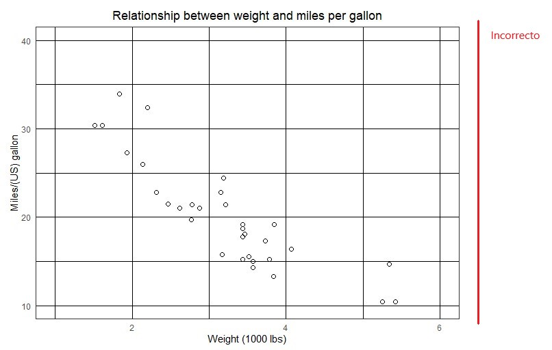
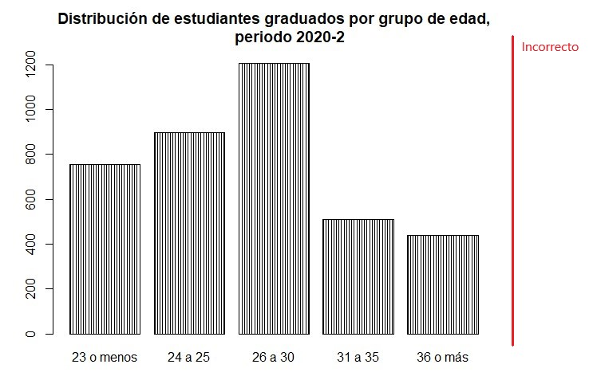

# Errores en la trama

```{r message=FALSE, warning=FALSE, include=FALSE}
library(UnalData)
library(dplyr)
library(ggplot2)
library(stringr)
library(magrittr)
library(tidyverse)
```

El principal y más grande error dentro de la visualización de datos es no respetar la integridad gráfica, por integridad gráfica nos referimos a los factores de engaño o adornos que se añaden, pensando que harán las figuras más atractivas y llamativas, pero en realidad saturan y opacan la verdadera intención de los gráficos que es informar. Un ejemplo claro de esto son las figuras 3D, las rejillas y los rellenos con patrones.

El factor de engaño corresponde a las distorsiones generadas por la mala elección de los elementos gráficos, también se incluyen elementos gráficos que no corresponden a variaciones de datos o que hacen más compleja la interpretación de estos. 

Un diseño muy popular que introduce una alta distorsión en los datos son los gráficos en 3D, muchos softwares de visualización permiten arreglar los gráficos convirtiéndolos en objetos tridimensionales que generalmente son rotados hasta conseguir una proyección bidimensional, comúnmente este efecto es aplicado a gráficos de torta, barras y dispersión. El principal problema con los diseños 3D es que la proyección a dos dimensiones para poder visualizarlos en un monitor distorsiona los datos, para ilustrar esto observe la figura \@ref(fig:circular3d-fig) que muestra la distribución de aspirantes a pregrado del programa PAES para el periodo 2021-1, note que la rebana correspondiente a la población afrocolombiana se ve más grande que la rebanada de comunidades indígenas, aunque claramente este no es el caso, ya que de los aspirantes a pregrado el $26\%$ pertenece a comunidades indígenas y el $17\%$ a la población afroamericana. Este es un claro ejemplo de los factores de engaño que se pueden introducir al gráfico a través de elementos estéticos como el diseño tridimensional.

```{r circular3d-fig, echo=FALSE, fig.align='center', fig.asp=.75, fig.cap='Uso incorrecto de las figuras en 3D', out.width='100%'}
knitr::include_graphics("Imágenes/circular3d.jpg")
```

Para eliminar el factor de engaño es necesario eliminar de la visualización el efecto 3D, para lograr que cada rebanada sea proporcional a cantidad que representa, como se muestra en la figura \@ref(fig:circularpaes-fig), a pesar de que esta visualización es mucho más clara que la anterior no es del todo correcta, ya que la variable discreta presenta seis categorías y este tipo de gráficos es recomendable cuando no se superan las cuatro categorías.

```{r circularpaes-fig, echo=FALSE, fig.align='center', fig.asp=.75, fig.cap='Eliminar efecto 3D', out.width='80%'}
paes <- Aspirantes %>% 
  filter(SEMESTRE == "1", YEAR == "2021", PAES != "NA") %>% 
  group_by(PAES) %>% 
  summarise(CANTIDAD = n()) %>% 
  transmute(PAES, CANTIDAD, 
            PORCENTAJE = paste(round((CANTIDAD/sum(CANTIDAD))*100, 2), 
                               "%", sep = ""))
paes$PAES <- str_replace_all(paes$PAES, 
                             "Victimas del conflicto armado interno en Colombia",
                             "Víctimas del conflicto armado")
ggplot(paes, aes(x = "", y = PORCENTAJE, fill = PAES))+
  geom_bar(stat = "identity", color = "black")+
  geom_text(aes(label = PORCENTAJE),
            position = position_stack(vjust = 0.5), color="Black", size = 4)+
  coord_polar(theta = "y") +
  scale_fill_manual(values=c("#0071bc", "#a39fcd", "#fbb03b",
                             "#6d6666", "#f15a24", "#8cc63f"), 
                    name = "")+
  theme_void()+
  theme(plot.title = element_text(hjust = 0.5),
        legend.position = 'bottom') +
  labs(title="DISTRIBUCIÓN DE ASPIRANTES A PREGRADO DEL PROGRAMA PAES,
       PERIODO 2021-1")
```

Cuando se presentan más de cuatro categorías es recomendable utilizar un gráfico de barras y ordenar las clases de manera decreciente para lograr una mejor comprensión por parte del usuario. 

En muchas ocasiones cuando se realizan gráficos de dispersión se opta por añadir rejillas con la intención de que el usuario identifique con facilidad las coordenadas X y Y de las observaciones, pero es común usar colores muy fuertes para estas rejillas opacando por completo las observaciones, como se ilustra en la figura \@ref(fig:usoderejillas-fig).

```{r usoderejillas-fig, echo=FALSE, fig.align='center', fig.asp=.75, fig.cap='Uso incorrecto de rejillas', out.width='100%'}

```
La figura \@ref(fig:usoderejillas-fig) representa la relación existente entre el peso en miles de libras y la distancia recorrida en millas por galón para 32 autos, esta figura es etiquetada como incorrecta ya que la rejilla se sobrepone a las observaciones creando una visualización saturada, poco comprensible y degrada la percepción de patrones en los datos. Lo recomendado en estas ocasiones es utilizar puntos rellenos y colores suaves para la rejilla por ejemplo tonalidades grises como se presenta en la figura \@ref(fig:rejillagris-fig).

```{r rejillagris-fig, echo=FALSE, fig.align='center', fig.asp=.75, fig.cap='Uso de rejillas en tonalidades suaves', out.width='80%'}
ggplot(mtcars , aes(x=wt, y=mpg)) + 
  geom_point(shape = 19, size = 2) +
  theme_bw() +
  coord_cartesian(ylim = c(10, 40), xlim = c(1,6)) +
  theme(plot.title = element_text(hjust = 0.5)) +
  theme(axis.ticks=element_blank()) +
  labs(x = "Weight (1000 lbs)",
       y = "Miles/(US) gallon",
       title = "Relationship between weight and miles per gallon")
```

Otro adorno comúnmente utilizado que es desagradable y quita la atención de los datos es usar patrones para rellenar las figuras, por ejemplo, utilizar líneas, puntos, estrellas u otras figuras para rellenar las barras, la figura \@ref(fig:barrasconpatrones-fig) muestra la distribución de los graduados por grupo de edad para el periodo 2020-2, se etiqueto como incorrecta ya que añadir patrones para rellenar las barras se considera poco atractivo y distrae la atención del usuario.

```{r barrasconpatrones-fig, echo=FALSE, fig.align='center', fig.asp=.75, fig.cap='Uso incorrecto de los patrones para rellenar', out.width='100%'}

```

Cuando se quiere añadir algún tipo de relleno a las barras se recomienda hacerlo con colores, usando escalas de colores cualitativas si la intención es distinguir datos o una escala secuencial si se trata de representar cantidades, la forma correcta o recomendada para realizar esta gráfica se muestra en la figura \@ref(fig:graduadosporgrupoedadcorrecto-fig).

```{r graduadosporgrupoedadcorrecto-fig, echo=FALSE, fig.align='center', fig.asp=.75, fig.cap='Uso de los rellenos de color', out.width='80%'}
Graduados <- UnalData::Graduados
cat_edad <- Graduados %>% 
  filter(YEAR == '2020', SEMESTRE == 2, EDAD_MOD <= 90) %>% 
  mutate(CATE_EDAD = ifelse(EDAD_MOD <= 23, "23 o menos", 
                            ifelse(EDAD_MOD >= 24 & EDAD_MOD <= 25, "24 a 25", 
                                   ifelse(EDAD_MOD >= 26 & EDAD_MOD <= 30, "26 a 30",
                                          ifelse(EDAD_MOD >= 31 & EDAD_MOD <= 35, "31 a 35", "36 o más"))))) %>% 
  group_by(CATE_EDAD) %>% 
  count()

ggplot(cat_edad, aes(x = CATE_EDAD, y = n, fill = CATE_EDAD)) +
  geom_bar(stat = "identity") +
  scale_fill_manual(values = c("#29abe2", "#c1272d", "#8cc63f", "#6d6666", 
                               "#fbb03b")) +
  theme_bw() +
  theme(legend.position = 'none',
        plot.title = element_text(hjust = 0.5)) +
  labs(x = "Edad en años",
       y = "Número de graduados", 
       title = "Distribución de estudiantes graduados por grupo de edad, periodo 2020-2")
```