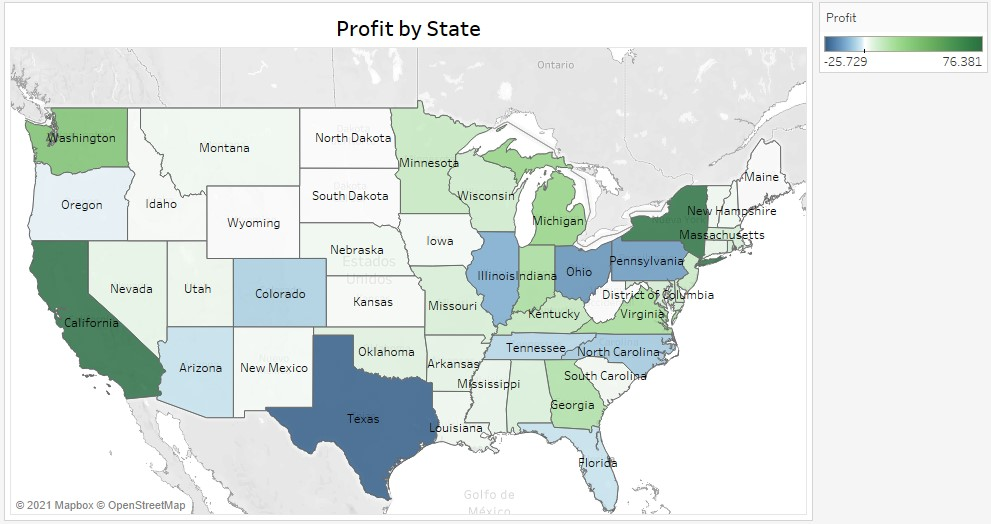

--- 
title: "Lineamientos conceptuales para la visualización estadística"
author: "Camila Acosta Ramirez"
date: "`r Sys.Date()`"
site: bookdown::bookdown_site
output: bookdown::gitbook
documentclass: book
bibliography: [book.bib, packages.bib]
biblio-style: apalike
link-citations: yes
---

# Portada{-}

Espacio para la portada ....

```{r include=FALSE}
# automatically create a bib database for R packages
knitr::write_bib(c(
  .packages(), 'bookdown', 'knitr', 'rmarkdown'
), 'packages.bib')
```

<!--chapter:end:index.Rmd-->

# Introduction {#intro}

What is Lorem Ipsum Lorem Ipsum is simply dummy text of the printing and typesetting industry Lorem Ipsum has been the industry's standard dummy text ever since the 1500s when an unknown printer took a galley of type and scrambled it to make a type specimen book it has?

You can label chapter and section titles using `{#label}` after them, e.g., we can reference Chapter \@ref(intro). If you do not manually label them, there will be automatic labels anyway, e.g., Chapter \@ref(methods).

Figures and tables with captions will be placed in `figure` and `table` environments, respectively.

```{r nice-fig, fig.cap='Here is a nice figure!', out.width='80%', fig.asp=.75, fig.align='center'}
par(mar = c(4, 4, .1, .1))
plot(pressure, type = 'b', pch = 19)
```

Reference a figure by its code chunk label with the `fig:` prefix, e.g., see Figure \@ref(fig:nice-fig). Similarly, you can reference tables generated from `knitr::kable()`, e.g., see Table \@ref(tab:nice-tab).

```{r nice-tab, tidy=FALSE}
knitr::kable(
  head(iris, 20), caption = 'Here is a nice table!',
  booktabs = TRUE
)
```

You can write citations, too. For example, we are using the **bookdown** package [@R-bookdown] in this sample book, which was built on top of R Markdown and **knitr** [@xie2015].

<!--chapter:end:01-intro.Rmd-->

# Partes principales de un gráfico

```{r message=FALSE, warning=FALSE, include=FALSE}
library(UnalR)
library(UnalData)
library(dplyr)
library(ggplot2)
library(hrbrthemes)
library(readxl)
library(gapminder)
library(stringr)
library(R.utils)
```

A la hora de crear un gráfico es necesario tener presente cada uno de los elementos que lo conforman y determinar cual es la mejor manera de representar cada uno de estos para lograr el impacto deseado en la visualización. El diseño correcto de estos elementos garantizara el éxito de su gráfico, al comunicar de manera acertada la información que pretende presentar. Dentro de la gama de gráficos estadísticos básicos se identifican tres elementos importantes los cuales son ejes, geometría en la cual se incluyen la forma, tamaño y color, tipos de líneas y texto el cual incluye las etiquetas de los ejes, titulo y leyenda.

```{r partesgrafico-fig, echo=FALSE, fig.align='center', fig.asp=.75, fig.cap='Principales partes de un gráfico', out.width='100%'}
knitr::include_graphics("Imágenes/partesdelgrafico.jpg")
```

La figura \@ref(fig:partesgrafico-fig) presenta estos elementos importantes. En los recuadros negros se encierra todo lo relacionado con texto, etiquetas de los ejes, título y leyenda; las líneas naranjadas representan los ejes del gráfico de manera horizontal corre el eje X y de manera vertical el eje Y. En la parte central de la visualización se ubican las observaciones a las cuales se les aplica la geometría, dependiendo del tipo de gráfico es posible cambiar el tamaño, forma y color de cado dato.

A continuación, se presentan las características que se consideraron más importantes para tener en cuenta a la hora de dar formato y personalizar cada uno de los elementos mencionados.

## Ejes

Los ejes son de los elementos de mayor relevancia dentro de cada gráfico ya que determina la posición donde se ubica cada dato. Cuando se trata de gráficos en dos dimensiones, los más comunes, las posiciones son descritas a través de dos valores que especifican un punto de forma única, y por lo tanto se necesitan escalas de posición, estas escalas son generalmente los ejes X y Y. Por convención general el eje X corre horizontalmente y el eje Y lo hace de manera vertical, aunque esto no siempre debe ser así, hay gráficos en los cuales los ejes son radiales.
El objetivo principal de las visualizaciones que se crean es comparar los datos, es decir, identificar el comportamiento de cada observación en relación con las demás que posee el conjunto de datos. Para realizar estas comparaciones es importante definir la escala de los ejes de manera adecuada, una mala elección de estas escalas lo puede conducir a interpretar la información de manera errada; es recomendable iniciar los ejes en 0, aunque no siempre es necesario si es importante considerar que los datos sean comparables.

Para ilustrar la importancia de la correcta elección del inicio del eje Y consideremos la visualización de cantidades a lo largo de una escala lineal. La figura \@ref(fig:usoincorrectoejey-fig) muestra las ventas en cinco estados de EE.UU; una vista rápida a esta visualización indica que las ventas en North Dakota son extremadamente bajas en comparación con los demás estados, sin embargo, este gráfico es engañoso ya que las ventas inician en $\$900$ USD, por lo tanto, mientras que el punto final de cada barra indica de manera correcta el total de ventas, la altura de la barra representa la medida en que las ventas superan los $\$900$ dólares; la percepción humana entenderá la altura de cada barra como las ventas por estado lo que conlleva a una interpretación errónea.


```{r usoincorrectoejey-fig, echo=FALSE, fig.align='center', fig.asp=.75, fig.cap='Ventas por estados de EE.UU, visualiazción engañosa', out.width='80%'}
Sample <- read_excel("Datos/Sample - Superstore.xls")
filtrar <- Sample %>% filter(State %in% c("North Dakota", "West Virginia", 
                                          "Maine", "South Dakota", "Wyoming"))
ggplot(filtrar, aes(x = State, y = Sales)) + 
  geom_bar(stat = "identity", fill = "skyblue") +
  coord_cartesian(ylim = c(900, 1700)) +
  labs(y = "Sales USD", 
       title = "Sales by states in USA")
```

La forma correcta de visualizar estos datos se presenta en la figura \@ref(fig:usocorrectoejeyinicio0-fig), es claro que existen diferencias entre las ventas por estados, pero no son tan distantes como lo muestra la figura \@ref(fig:usoincorrectoejey-fig), las ventas en los cinco estados presentados son comparables. En este caso es particular se debe seguir la regla de iniciar los ejes en cero.   

```{r usocorrectoejeyinicio0-fig, echo=FALSE, fig.align='center', fig.asp=.75, fig.cap='Ventas por estados de EE.UU, uso correcto de la escala lineal', out.width='80%'}
ggplot(filtrar, aes(x = State, y = Sales)) + 
  geom_bar(stat = "identity", fill = "skyblue") +
  coord_cartesian(ylim = c(0, 1700)) +
  labs(y = "Sales USD", 
       title = "Sales by states in USA")
```
## Geometría

La geometría es una parte primordial y que hará las visualizaciones mucho mas claras y entendibles. Dentro de las geometrías principales podemos considerar la forma, tamaño, tipo de línea y color.

### Forma y tipo de línea

Estas dos son estéticas o atributos que generalmente se usan para representar datos categóricos, dentro de visualizaciones discretas o continuas. Cuando se trata de gráficos de dispersión se opta por usar diferentes formas a partir de una variable categórica con el fin de comparar los comportamientos de cada uno de los valores que toma la variable cualitativa. En el caso de los gráficos de líneas se opta por usar diferentes estilos o tipos de líneas nuevamente con el fin de diferenciar la categoría de los datos, por lo general los estilos usados son líneas continuadas y punteadas. Ambos elementos pueden ser usados para distinguir o resaltar, en el caso de ser usados para distinguir se asigna una forma o tipo de línea a cada uno de los niveles de la variable categórica y en el caso de resaltado se usa la misma forma o tipo de línea para todos los datos excepto para aquellos elementos que queremos resaltar.

La figura \@ref(fig:formasparadistinguir-fig) ilustra el uso de distintas formas para distinguir las especies de flores registradas en la base de datos Iris. Como ya se menciono se usan tantas formas como niveles tenga la variable categórica, en este caso se usan círculos, triángulos y cuadrados.

```{r formasparadistinguir-fig, echo=FALSE, fig.align='center', fig.asp=.75, fig.cap='Uso de las formas para distinguir grupos de datos', out.width='80%'}
ggplot(iris, aes(x=Sepal.Length, y=Sepal.Width, shape=Species)) + 
  geom_point(size=2) +
  labs(x = "Sepal Lenght", y = "Sepal Width", 
       title = "Sepal Lenght vs Sepal Width by species")
```

Si quisiéramos resaltar una de las especies por ejemplo, Visicolor debemos asignar la misma forma a las especies Setosa y Virginica y una distinta a la especie a resaltar, por ejemplo usar círculos y triángulos, como se presenta en la figura \@ref(fig:formaspararesaltar-fig).

```{r formaspararesaltar-fig, echo=FALSE, fig.align='center', fig.asp=.75, fig.cap='Uso de las formas para resaltar un grupo de observaciones', out.width='80%'}
ggplot(iris, aes(x=Sepal.Length, y=Sepal.Width)) + 
  geom_point(aes(shape = Species), size = 3) +
  scale_shape_manual(values = c(19, 17, 19)) +
  labs(x = "Sepal Lenght", y = "Sepal Width", 
       title = "Sepal Lenght vs Sepal Width by species")
```
### Tamaño 

El tamaño generalmente es una estética usada en gráficos de dispersión, se incluye una nueva variable continua o discreta que determina el tamaño de cada observación representada en el gráfico. Este atributo es de gran utilidad, pero se debe tener mucho cuidado al usarlo, ya que en el caso de datos desproporcionados un solo punto ocupará un tamaño exagerado que será poco comparable con los demás datos.

La figura \@ref(fig:usotamanodiscreto-fig) ilustra el uso de una variable discreta para asignar diferentes tamaños a las observaciones.

```{r usotamanodiscreto-fig, echo=FALSE, fig.align='center', fig.asp=.75, fig.cap='Asignación de tamaños mediante una variable discreta', message=FALSE, warning=FALSE, out.width='80%'}
ggplot(iris, aes(x=Sepal.Length, y=Sepal.Width, size = Species, color = Species)) + 
  geom_point() + 
  labs(x = "Sepal Lenght", y = "Sepal Width", 
       title = "Sepal Lenght vs Sepal Width by species")
```

La figura \@ref(fig:usotamanocontinuo-fig) muestra el uso de una variable continua para determinar el tamaño de cada observación, note que a demás de la geometría relacionada al tamaño se debe usar la transparencia para evitar que los países con mayor población oculten o se sobrepongan a aquellos a países de menor población.

```{r usotamanocontinuo-fig, echo=FALSE, fig.align='center', fig.asp=.75, fig.cap='Asignación de tamaños mediante una variable continua', out.width='80%'}
data <- gapminder %>% filter(year=="2007") %>% dplyr::select(-year)
data %>%
  arrange(desc(pop)) %>%
  mutate(country = factor(country, country)) %>%
  ggplot(aes(x=gdpPercap, y=lifeExp, size = pop)) +
  geom_point(alpha=0.5) +
  scale_size(range = c(.1, 24)) + 
  theme(legend.position = 'none') +
  labs(title = "GDP per capita and life expectancy")
```
### Color

El color es una de las estéticas más importantes y que pueden marcar una gran diferencia en la interpretación de sus datos. Existen algunos colores que destacan más que otros por lo que darán un peso innecesario a los datos, es decir, que atraen la atención de los usuarios a esos puntos y que pueden no necesariamente ser los de interés central, también es recomendable no superar los seis colores por gráfico. El color dentro de una visualización puede ser usado principalmente para tres casos: para distinguir grupos de datos entre sí, uso del color para representar valores de datos y finalmente puede ser usado para resaltar.

#### Distinguir grupos de datos

Emplear el color como una herramienta para distinguir es uno de los usos más comunes que se le da al color cuando se trata de gráficos que incluyen variables categóricas y que no tienen un orden específico como diferentes niveles de formación dentro de una universidad o departamentos dentro de un mapa. En este caso, se utiliza una escala de colores cualitativa la cual contiene un conjunto finito de colores específicos que se eligen para versen claramente distintos entre sí y que al mismo tiempo deben ser equivalentes entre sí. Es decir que lo colores seleccionados se deben poder diferenciar de manera clara y precisa, pero uno no debe resaltar más que otro. También es importante que el conjunto de colores seleccionados no presente un orden ya que esto creara un orden en la visualización que por definición de los datos no se tiene. Como recomendación general, las escalas de color cualitativas funcionan mejor cuando hay de tres a cinco categorías diferentes; tener ocho o diez categorías hará que la tarea de hacer coincidir los colores sea tediosa, a demás la leyenda será demasiado extensa y el usuario tendrá que hacer un fuerte trabajo de búsqueda para identificar el color correspondiente a cada categoría; en el caso de muchas categorías se recomienda usar etiquetas directas sobre la observación para así facilitar la comprensión del gráfico aunque con esto también se debe tener cuidado ya que muchas etiquetas hará que la visualización se sature y la información no sea transmitida de la manera correcta.

La figura \@ref(fig:usocolordistinguir-fig) muestra el uso correcto de los colores como herramienta para distinguir, se seleccionaron colores que contrastan entre sí pero no compiten por la atención, este gráfico en particular posee ocho categorías distintas pero aún así se logra identificar claramente cada una de las sedes de admisión.

```{r usocolordistinguir-fig,echo=FALSE, fig.align='center', fig.asp=.75, fig.cap='Uso del color como herramienta para distinguir grupos de datos', message=FALSE, warning=FALSE, out.width='100%'}
col <- c("#29ABE2", # AZUL CLARO  | Amazonia
         "#8CC63F", # VERDE       | Bogota
         "#CC241D", # ROJO        | Caribe
         "#FF3673", # MORADO CLARO| De la paz
         "#0071BC", # AZUL VIVO   | Manizales
         "#F15A24", # NARANJA     | Medellin
         "#FBB03B", # AMARILLO    | Orinoquia
         "#93278F", # MORADO      | Palmira
         "#8A381A") # GRIS        | Tumaco
Msj <- ""
Plot.Series(datos     = Consolidado,
            categoria = "SEDE_NOMBRE_ADM",
            colores   = col,
            titulo    = "EVOLUCI\u00d3N DEL N\u00daMERO DE GRADUADOS POR SEDE",
            labelY    = "N\u00famero de graduados (k: miles)",
            libreria  = "plotly",
            estilo    = list(LegendTitle = "SEDE:", ply.Interaction = "closest",
                             ply.LegendPosition = list(x = 0.16, y = -0.25, orientation = "h"),
                             ply.Credits = list(x = 0.5, y = 0.95, text = Msj))
)
```

#### Representar valores

El color también puede ser usado como herramienta para representar variables cuantitativas como ingresos, temperatura, entre otros. En este caso se usa una escala de color secuencial, la cual indica claramente que valores son más grandes o pequeños y que tan distantes se encuentran dos valores específicos entre sí. Estas escalas secuenciales de color pueden basarse en un solo tono por ejemplo de azul oscuro a azul claro, o en múltiples matices por ejemplo de rojo oscuro a amarillo claro.

En la figura \@ref(fig:usocolorrepresentar-fig) presenta un uso adecuado de la escala de colores secuencial, se usa una paleta de un solo tono que inicia en azul claro y termina en un azul un poco más fuerte. Esta visualización presenta la cantidad de estudiantes graduados en el periodo 2020-II por departamento de nacimiento y la escala de color fue usada para colorear el conteo por cada uno de estos departamentos.

```{r usocolorrepresentar-fig, echo=FALSE, fig.align='center', fig.asp=.75, fig.cap='Uso del color para representar valores', message=FALSE, warning=FALSE, out.width='100%'}
Graduados <- UnalData::Graduados
if (require("dplyr")) {
  Graduados <- Graduados %>%
    select(Code_Dept    = COD_DEP_NAC,
           Code_Mun     = COD_CIU_NAC,
           Departamento = DEP_NAC,
           Municipio    = CIU_NAC,
           Longitud     = LON_CIU_NAC,
           Latitud      = LAT_CIU_NAC) %>%
    filter(!is.na(Departamento))
}
Plot.Mapa(datos    = Graduados,
          tipo     = "Deptos",
          titulo   = "Graduados 2020-II",
          baldosas = c("Stamen.Toner", "Stamen.TonerLite", "Stamen.TonerLines", "Esri.DeLorme",
                       "Esri.WorldTerrain", "Esri.WorldShadedRelief", "Esri.WorldPhysical",
                       "Esri.OceanBasemap", "Esri.WorldGrayCanvas"),
          colSedes = rep("green", 9),
          compacto = FALSE,
          textSize = 16,
          limpio   = TRUE,
          colores = c('#e8f5ff', '#c3e3fd', '#9acef8', '#6eb8f5', '#2196f3'),
          cortes = c(0, 20, 50, 200, 1000, Inf)
)
```

Existen algunas ocasiones en las cuales es necesario visualizar la desviación de los valores de los datos en una de dos direcciones en relación con un punto medio neutral. Un ejemplo sencillo y muy básico de estos casos es cuando se tienen números positivos y negativos, que se representan por dos colores, puede ser verde para los números positivos y rojo para los negativos, a partir de la intensidad de estos colores se indica la lejanía con el cero. La escala de color usada en estos casos se denomina divergente y puede pensarse como dos escalas de colores secuenciales que se unen en un punto medio; estas escalas deben ser equilibradas, de modo que la progresión de los colores claros en el centro a los colores oscuros del exterior debe ser la aproximadamente igual para ambas direcciones.

```{r escaladivergente-fig,echo=FALSE, fig.align='center', fig.asp=.75, fig.cap='Escala divergente para representar valores', out.width='100%'}

```

La figura \@ref(fig:escaladivergente-fig) presenta una de los tantos usos que se le puede dar a las escalas de colores divergentes, se presenta los beneficios por estados. Es importante notar que la escala de colores no se encuentra equilibrada y esto se debe a la desproporción de los datos, a pesar de esto la visualización sigue siendo informativa y se logra distinción entre los colores.

#### Resaltar observaciones

Emplear el color para resaltar observaciones es de gran utilidad cuando el conjunto de datos contiene información clave sobre la historia que se quiere contar a través del gráfico y enfatizar en estos elementos conlleva a una mejor comprensión de la información que se desea comunicar. Para lograr este énfasis podemos colorear estos elementos de la figura con colores o tonalidades que se destaquen vívidamente contra el resto de la figura; generalmente se usan escalas de color de acento, las cuales contienen tanto un conjunto de colores tenues como un conjunto coincidente de colores más fuertes.

Cuando se trabaja con una escala de color de acento, es fundamental que los colores básicos no compitan por la atención. Estos colores de base deben ser monótonos pero que apoye bien el color de acento, es muy común cometer el error de usar colores de línea de base que son demasiado coloridos, de modo que terminan compitiendo por la atención del lector. Una alternativa fácil es usar un color neutro en todos los elementos de la figura, excepto para la categoría de puntos que se quiere resaltar.

La figura \@ref(fig:resaltardatos-fig) muestra el total de estudiantes admitidos por departamento de nacimiento, se hace uso de una escala de color de acento para resaltar los departamentos pertenecientes a la región andina. Observe que se usa un color neutro para los departamentos que no son de interés y un color azul llamativo para atraer la atención del usuario a la región andina. Esta figura presenta uno de los tantos usos que se le puede dar a las escalas de colores de acento para resaltar datos, es posible aplicarla a gráficos de líneas, diagramas de dispersión, entre otros.

```{r resaltardatos-fig, echo=FALSE, fig.align='center', fig.asp=.75, fig.cap='Escala de color de acento para resaltar observaciones', out.width='80%'}
Aspirantes <- UnalData::Aspirantes
Admitidos <- Aspirantes %>% filter(ADMITIDO == 'Sí', YEAR == '2020', SEMESTRE == 2, DEP_NAC != "NA") %>% 
  mutate(DEP_NAC = str_replace(DEP_NAC, 
                               'ARCHIPIÉLAGO DE SAN ANDRÉS, PROVIDENCIA Y( SANTA CATALINA)?', 
                               'SAN ANDRÉS'))
Admitidos$DEP_NAC <- str_replace(Admitidos$DEP_NAC, 'DEPARTAMENTO EXTRANJERO', 'DPTO EXTRANJERO')
Admitidos$DEP_NAC <- str_to_title(str_to_lower(Admitidos$DEP_NAC))

deptosnac <- Admitidos %>% group_by(DEP_NAC) %>% count()

Regiones <- read.csv("Datos/Regiones_colombia.csv", sep = ";", header = TRUE)
deptos_region <- left_join(Regiones, deptosnac, 
                        by = c("Departamento" = "DEP_NAC"))

ggplot(data=deptos_region, 
       aes(x=reorder(Departamento, n), 
           y=n, 
           fill = Region)) + 
  geom_bar(stat="identity", position="dodge") +
  coord_flip() + 
  labs(y = "Número de estudiantes admitidos", 
       x = "Departamento de nacimiento", 
       title = "Distribución de estudiantes admitidos por departamento") +
  scale_y_continuous(breaks=seq(0, 3000, 500)) +
  scale_fill_manual(values = c("cornsilk3", "#29abe2", "cornsilk3" , 
                               "cornsilk3", "cornsilk3"))

```

## Texto

Al momento de realizar una visualización el texto es uno de los elementos a los cuales se les presta poca atención pero que podrían hacer el gráfico aún mas informativo, se debe manejar una misma fuente pero proporcionar un balance entre los tamaños con el fin de destacar los elementos importantes, por ejemplo, el título de la visualización debe atraer más la atención del usuario que las etiquetas del eje por esta razón no es correcto utilizar un tamaño mayor para las etiquetas del eje que para el título. El éxito de la estética de este elemento se basa en establecer correctamente la jerarquía que existe entre los textos que involucra el gráfico.

El objetivo principal de una visualización es informar y transmitir información de manera clara y concisa, por esta razón se deben colocar los datos en contexto proporcionando títulos, subtítulos y otras anotaciones que los acompañen. A continuación, analizaremos algunas recomendaciones utiles que nos ayudarán a contextualizar los datos de manera correcta.

Uno de los elementos principales dentro de un gráfico es su título, este debe ser claro e informativo ya que su función es transmitir con precisión al lector de qué se trata la figura, también existen ocasiones en las que es necesario usar subtítulos para contextualizar por completo al usuario acerca de la información que se presenta. Otro elemento importante y que logra que las visualizaciones se expliquen por sí mismas son los títulos de los ejes, estos deben indicar de manera clara lo que representan y la unidad en que se miden, observe la figura \@ref(fig:usocorrectoejeyinicio0-fig) en la cual el eje Y esta titulado de manera correcta ya que indica que representa las ventas y esta medido en dólares; los títulos de las leyendas también deben ser claros e indicar lo que representan como se muestra en la figura \@ref(fig:resaltardatos-fig), donde el título de la leyenda hace referencia a la región geográfica del país, en algunas ocasiones es posible omitir el título de los ejes o de las leyendas, es decir, cuando las etiquetas son completamnete explícitas.

La figura \@ref(fig:usoincorrectotextos-fig) ilustra lo que no se debe hacer en una visualización ya que se le da enfoque princical a las etiquetas del eje y leyenda y no al título de la figura, el cual informa acerca de la visualización.

```{r usoincorrectotextos-fig, echo=FALSE, fig.align='center', fig.asp=.75, fig.cap='Uso incorrecto del texto', message=FALSE, warning=FALSE, out.width='80%'}
  ggplot(iris, aes(x = Sepal.Width, y = Sepal.Length, color = Species)) + 
  geom_point(stat = "identity", size = 4, color = "#000000") +
  geom_point(stat = "identity", size = 3) + 
  labs(title = "Sepal Width vs Sepal Length by Species",
                               x = "Sepal Width", 
                               y = "Sepal Length") + 
  theme(text = element_text(family="Arial", size = 15),
        plot.title = element_text(size = 10)) 
```

La figura \@ref(fig:manejotextos-fig) presenta la clara jerarquía existente entre los textos del gráfico, observe que se traba con la misma fuente pero se juega con mayúsculas y minúscolas para dar la importancia que cada elemento requiere, esta visualización es un ejemplo en el cual se puede omitir el título de la leyenda, ya que las etiquetas son tan claras que usar un título conlleva a un gráfico saturado. 

```{r manejotextos-fig, echo=FALSE, fig.align='center', fig.asp=.75, fig.cap='Uso correcto del texto para contextualizar', out.width='90%'}
ano <- 2020; semestre <- 2
col <- c("#F15A24", "#8CC63F")
Msj <- ""
Plot.Torta(datos      = Consolidado,
           categoria  = "SEXO",
           ano        = ano,
           periodo    = semestre,
           colores    = col,
           titulo     = "DISTRIBUCI\u00d3N DE GRADUADOS POR SEXO",
           addPeriodo = TRUE,
           libreria   = "highcharter",
           estilo     = list(LegendTitle = "",
                             hc.Tema = 4, hc.Credits = Msj)
)
```


<!--chapter:end:02-literature.Rmd-->

# ¿Cómo visualizar los datos? 

```{r message=FALSE, warning=FALSE, include=FALSE}
library(UnalR)
library(UnalData)
library(dplyr)
library(ggplot2)
library(stringr)
library(magrittr)
library(tidyverse)
```


En la actualidad hay muchos gráficos disponibles para visualizar nuestros datos, pero no todos los gráficos pueden ser usados para lo que se quiere representar, por esta razón es importante conocer cuáles son los gráficos apropiados para los datos que se quieren mostrar. Dentro de los datos mas comunes a visualizar se tienen las cantidades, proporciones, distribuciones, series de tiempo, datos geoespaciales y las relaciones X-Y.
En este capitulo se presenta la forma correcta de representar estos datos con los gráficos que se tienen disponibles, teniendo el contraste entre lo correcto e incorrecto con el fin de informar al usuario acerca de lo que se debe o no hacer para crear las visualizaciones.

## Visualización de cantidades

En muchas ocasiones estamos interesados en visualizar la magnitud de algún conjunto de números, por ejemplo, visualizar el volumen de ventas por estados, total de estudiantes admitidos por modalidad de formación, estudiantes graduados por grupos de edad o departamento. Observe que en todos estos casos de tiene un conjunto de categorías y un valor cuantitativo para cada categoría. La visualización recomendada y más usada en este escenario es el gráfico de barras en el cual se incluyen distintas variaciones tales como las barras simples, agrupadas y apiladas tanto verticales como horizontales. Las alternativas al diagrama de barras son los diagramas de puntos y mapas de calor.

### Gráfico de barras

Suponga que queremos visualizar la cantidad de estudiantes de estudiantes admitidos por nivel de formación para el periodo 2021-1, este tipo de datos se visualiza comúnmente con barras verticales, para cada nivel de formación de dibuja una barra que inicia en cero y se extiende hasta la cantidad de estudiantes admitidos. La figura \@ref(fig:barrasadmitidosnivel-fig) muestra el uso del gráfico de barras para visualizar estas cantidades.

```{r barrasadmitidosnivel-fig, echo=FALSE, fig.align='center', fig.asp=.75, fig.cap='Uso del gráfico de barras para representar cantidades'}
Aspirantes <- UnalData::Aspirantes
Admitidos <- Aspirantes %>% 
  filter(ADMITIDO == 'Sí', YEAR == '2021', SEMESTRE == 1) %>% 
  group_by(NIVEL) %>% 
  count()
ggplot(data = Admitidos, aes(x = reorder(NIVEL,-n), y = n, fill = NIVEL,
                             width=.5)) +
  geom_bar(stat = "identity") +
  scale_fill_manual(values = c("#6d6666", "#fbb03b", "#29abe2", "#c1272d", "#8cc63f")) +
  theme(legend.position = 'none') +
  labs(x = "", 
       y = "Número de admitidos", 
       title = "Distribución de estudiantes admitidos por nivel de formación, periodo 2021-1")

```

Uno de los problemas mas comunes con los gráficos de barras verticales es que las etiquetas que identifican cada barra ocupan mucho espacio horizontal. Por esta razón en la figura \@ref(fig:barrasadmitidosnivel-fig) fue necesario aumentar la separación entre las barras para poder ubicar las etiquetas en la parte inferior de cada barra y que estas no se traslaparan. Una solución a este problema es girar las etiquetas de cada barra como se muestra en la figura \@ref(fig:barrasadmitidosnivelgirar-fig), pero esto no estéticamente correcto, ya que es incómodo para el usuario.

```{r barrasadmitidosnivelgirar-fig, echo=FALSE, fig.align='center', fig.asp=.75, fig.cap='Uso del gráfico de barras para representar cantidades, girando etiquetas'}
ggplot(data = Admitidos, aes(x = reorder(NIVEL,-n), y = n, fill = NIVEL)) +
  geom_bar(stat = "identity") +
  scale_fill_manual(values = c("#6d6666", "#fbb03b", "#29abe2", "#c1272d", "#8cc63f")) +
  theme(legend.position = 'none', axis.text.x = element_text(angle = 45, hjust = 1)) +
  labs(x = "", 
       y = "Número de admitidos", 
       title = "Distribución de estudiantes admitidos por nivel de formación, periodo 2021-1")

```

La mejor solución para etiquetas largas es cambiar a un gráfico de barras horizontales, de esta manera no será necesario aumentar el espaciado entre barras ni girar las etiquetas y se obtiene una visualización compacta en la cual todos los elementos visuales están ubicados de manera horizontal y hace que el gráfico sea más fácil de leer.

```{r barrasadmitidosnivelhorizontal-fig, echo=FALSE, fig.align='center', fig.asp=.75, fig.cap='Uso del gráfico de barras horizontales para representar cantidades'}
ggplot(data = Admitidos, aes(x = reorder(NIVEL,n), y = n, fill = NIVEL)) +
  geom_bar(stat = "identity") +
  scale_fill_manual(values = c("#6d6666", "#fbb03b", "#29abe2", "#c1272d", "#8cc63f")) +
  theme(legend.position = 'none') +
  coord_flip() +
  labs(x = "", 
       y = "Número de admitidos", 
       title = "Distribución de estudiantes admitidos por nivel de formación,
       periodo 2021-1") 
```
Sin importar la posición de las barras es decir si son horizontales o verticales se debe prestar mucha atención al orden en el cual se ubica cada barra, en muchas ocasiones las barras están dispuestas de forma arbitraria o por algún criterio que no es significativo en el contexto de la figura, algunos programas simplemente ubican las etiquetas por orden alfabético o algún otro criterio.

Sin embargo, las etiquetas solo pueden ser reordenadas cuando las categorías que representan no tienen un orden natural establecido. Siempre que exista un orden natural en los datos es necesario mantener este orden para representar los datos de la manera correcta. Suponga que se desea visualizar la cantidad de estudiantes graduados en el periodo 2020-2 por grupos de edad. En este caso las barras deben ordenarse de manera creciente según el grupo de edad como se ilustra en la figura \@ref(fig:graduadosporgrupoedad-fig). En este caso no tiene sentido ordenar por la altura de la barra, es decir de forma ascendente o descendente ya que las etiquetas perderán el orden natural que poseen.

```{r graduadosporgrupoedad-fig, echo=FALSE, fig.align='center', fig.asp=.75, fig.cap='Etiquetas con un orden natural'}
Graduados <- UnalData::Graduados

cat_edad <- Graduados %>% 
  filter(YEAR == '2020', SEMESTRE == 2, EDAD_MOD <= 90) %>% 
  mutate(CATE_EDAD = ifelse(EDAD_MOD <= 23, "23 o menos", 
                            ifelse(EDAD_MOD >= 24 & EDAD_MOD <= 25, "24 a 25", 
                                   ifelse(EDAD_MOD >= 26 & EDAD_MOD <= 30, "26 a 30",
                                          ifelse(EDAD_MOD >= 31 & EDAD_MOD <= 35, "31 a 35", "36 o más"))))) %>% 
  group_by(CATE_EDAD) %>% 
  count()

ggplot(cat_edad, aes(x = CATE_EDAD, y = n, fill = CATE_EDAD)) +
  geom_bar(stat = "identity") +
  scale_fill_manual(values = c("#29abe2", "#c1272d", "#8cc63f", "#6d6666", 
                               "#fbb03b")) +
  theme(legend.position = 'none') +
  labs(x = "Edad en años",
       y = "Número de graduados", 
       title = "Distribución de estudiantes graduados por grupo de edad,
       periodo 2020-2")
```

### Barras agrupadas y apiladas

Las figuras mostradas en la subsección anterior representan variables cualitativas en relación con una variable categórica. Sin embargo, a menudo es de interés visualizar como estos valores varían según dos variables categóricas; en un diagrama de barras apiladas, se dibuja un grupo de barras en cada posición del eje X, determinado por una variable categórica, y luego se dibujan barras dentro de cada grupo con la otra variable categórica de interés, por ejemplo, es posible representar el número de funcionarios adminsitrativos por años de servicio prestado y sexo para el periodo 2020-2 tal y como se ilustra en la figura \@ref(fig:barrasagrupadasservicioedad-fig).

```{r barrasagrupadasservicioedad-fig, echo=FALSE, fig.align='center', fig.asp=.75, fig.cap='Uso de barras agrupadas para representar valores usando dos categorías'}
Administrativos <- UnalData::Administrativos
servicio_sexo <- Administrativos %>% 
  group_by(CAT_SERVICIO, SEXO) %>% 
  count() %>% 
  mutate(CAT_SERVICIO = str_replace_all(CAT_SERVICIO, " años", ""))

servicio_sexo$CAT_SERVICIO <- factor(servicio_sexo$CAT_SERVICIO, 
                                     levels = c("9 o menos", "10 a 19", 
                                                "20 a 29", "30 a 39", 
                                                "40 o más"))

ggplot(data = servicio_sexo, aes(x = CAT_SERVICIO, y = n, fill = SEXO)) +
  geom_bar(stat = "identity", position = "dodge") + 
  scale_fill_manual(values = c("#f15a24", "#8cc63f"), name = "Sexo") +
  theme(legend.position = 'bottom') + 
  labs(x = "Años de servicio",
       y = "Número de funcionarios", 
       title = "Distribución de funcionarios por años de servicio y sexo, periodo 2020-2")
```

Con los gráficos de barras agrupadas se debe tener cuidado ya que las variables categóricas elegidas pueden tener muchos niveles y harán que le grafico se sature y el usuario no comprenda la información de manera correcta, la figura \@ref(fig:barrasagrupadasserviciosede-fig) muestra la distribución del número de funcionarios por años de servicio y sede para el periodo 2020-2, aunque la figura es correcta resulta difícil de interpretar por la cantidad de sedes existentes dentro de la Universidad Nacional de Colombia, observe que para cada grupo de años de servicio se crean ocho barras

```{r barrasagrupadasserviciosede-fig, echo=FALSE, fig.align='center', fig.asp=.75, fig.cap='Cantidad de funcionarios por años de servicio y sede'}
Administrativos <- UnalData::Administrativos
servicio_sede <- Administrativos %>% 
  group_by(CAT_SERVICIO, SEDE) %>% 
  count() %>% 
  mutate(CAT_SERVICIO = str_replace_all(CAT_SERVICIO, " años", ""))
servicio_sede$CAT_SERVICIO <- factor(servicio_sede$CAT_SERVICIO, 
                                     levels = c("9 o menos", "10 a 19", 
                                                "20 a 29", "30 a 39", 
                                                "40 o más")) 
servicio_sede$SEDE <- factor(servicio_sede$SEDE, 
                             levels = c("Bogotá", "Medellín", "Nivel Nacional", 
                                        "Manizales", "Palmira", "La Paz",
                                        "Amazonía", "Orinoquía", "Caribe",
                                        "Tumaco"))


ggplot(data = servicio_sede, aes(x = CAT_SERVICIO, y = n, fill = SEDE)) +
  geom_bar(stat = "identity", position = "dodge") +
  scale_fill_manual(values = c("#8cc63f", "#f15a24", "#2ca25f", "#0071bc", 
                               "#93278f", "#9e9ac8", "#5bc0de", "#fbb03b", 
                               "#c1272d", "#6d6666"), name = "Sede") +
  theme(legend.position = 'bottom') + 
  labs(x = "Años de servicio",
       y = "Número de funcionarios", 
       title = "Distribución de funcionarios por años de servicio y sede, periodo 2020-2")
```

Una alternativa a esta figura es visualizar como categoría principal la sede a la que pertenece cada funcionario y que los grupos de barras para cada sede se creen a partir de los años de servicio prestados, usando una escala de color secuencial para representar cada uno de los años de servicio prestado por los funcionarios administrativos, con esto solo se tendrán 5 barras por cada sede y el gráfico será más sencillo y comprensible, como se muestra en la figura \@ref(fig:barrasagrupadassedeservicio-fig).

```{r barrasagrupadassedeservicio-fig, echo=FALSE, fig.align='center', fig.asp=.75, fig.cap='Cantidad de funcionarios por sede y años de servicio'}

ggplot(data = servicio_sede, aes(x = reorder(SEDE,n), y = n, 
                                 fill = CAT_SERVICIO)) +
  geom_bar(stat = "identity", position = "dodge") +
  scale_fill_manual(values = c('#48CAE4', '#00B4D8', '#0096C7', '#0077B6', 
                               '#023E8A'), 
                    name = "Años de servicio") +
  theme(legend.position = 'bottom') + 
  labs(x = "",
       y = "Número de funcionarios", 
       title = "Distribución de funcionarios sede y años de servicio, periodo 2020-2") + 
  coord_flip()
```

Como ya vimos los gráficos de barras agrupadas consisten en dibujar una barra al lado de la otra, pero hay ocasiones en las cuales se prefiere apiliar las barras, es decir, ubicar una encima de la otra, esto generalmente se realiza cuando la cantidad representada por las barras dispuestas en esta posición es significativa, también es necesario tener cuidado con este tipo de gráficos ya que utilizar muchas categorías para apilar las barras resultara en una visualización saturada y poco informativa. Un uso común de este tipo de gráficos es cuando las barras individuales representan recuentos, por ejemplo, el conjunto de datos llamado Administrativos posee el recuento de funcionarios por sexo, para este casi si apilamos una barra que representa el recuento de mujeres encima de una barra que representa el recuento de hombres, entonces la altura de la barra combinada mostrara el total de funcionarios independiente del género. La figura \@ref(fig:barrasaplidasserviciosexo-fig) presenta el uso de barras apiladas como alternativa del uso de barras agrupadas ilustrado en la figura \@ref(fig:barrasagrupadasservicioedad-fig).

```{r barrasaplidasserviciosexo-fig, echo=FALSE, fig.align='center', fig.asp=.75, fig.cap='Barras apiladas como una alternativa a las barras agrupadas'}
Administrativos <- UnalData::Administrativos
servicio_sexo <- Administrativos %>% 
  group_by(CAT_SERVICIO, SEXO) %>% 
  count() %>% 
  mutate(CAT_SERVICIO = str_replace_all(CAT_SERVICIO, " años", ""))

servicio_sexo$CAT_SERVICIO <- factor(servicio_sexo$CAT_SERVICIO, 
                                     levels = c("9 o menos", "10 a 19", 
                                                "20 a 29", "30 a 39", 
                                                "40 o más"))

ggplot(data = servicio_sexo, aes(x = CAT_SERVICIO, y = n, fill = SEXO)) +
  geom_bar(stat = "identity", position = "stack") + 
  scale_fill_manual(values = c("#f15a24", "#8cc63f"), name = "Sexo") +
  theme(legend.position = 'bottom') + 
  labs(x = "Años de servicio",
       y = "Número de funcionarios", 
       title = "Distribución de funcionarios por años de servicio y sexo, periodo 2020-2")
```

### Gráficos de puntos y mapas de calor

Una de las mayores limitaciones al usar los gráficos de barras ya sean simples o alguna de sus variaciones es que los ejes deben iniciar en cero para lograr que la altura de la barra sea proporcional a la cantidad que representa, existen muchas ocasiones en las cuales es poco practico iniciar siempre los ejes en cero y una alternativa es usar puntos ubicados en lugares apropiados a lo largo del eje X o Y.

Suponga que se quiere visualizar la edad promedio de los estudiantes graduados por nivel de formación, observe que en este caso no tiene mucho sentido iniciar el eje Y en cero ya que la edad promedio estará por encima de los 20 años aproximadamente y las discrepancias entre los promedios de edades no son muy grandes, por esta razón es conveniente restringir el dominio de eje x al intervalo de 20 a 40 años, para que las diferencias sean notorias y la información sea interpretada con mayor facilidad, como se ilustra en la figura \@ref(fig:diagramapuntos-fig).

```{r diagramapuntos-fig, echo=FALSE, fig.align='center', fig.asp=.75, fig.cap='Diagrama de puntos como alternativa a los gráficos de barras', warning=FALSE, message=FALSE}
Graduados <- UnalData::Graduados
Graduados %<>% drop_na(EDAD_MOD)
edad <-  Graduados %>%
  mutate(NIVEL = str_replace_all(NIVEL, "(M|m)?édicas", "Médicas")) %>% 
  group_by(NIVEL) %>% 
  summarise(MEAN_EDAD = mean(EDAD_MOD))

ggplot(edad, aes(x = reorder(NIVEL, MEAN_EDAD), y = MEAN_EDAD, col = NIVEL)) +
  geom_point(size = 3.5) +
  coord_cartesian(ylim = c(20, 40))  +
  scale_colour_manual(values = c("#8cc63f" , "#29abe2", "#fbb03b", "#c1272d", 
                                 "#6d6666")) + 
  theme(legend.position = 'none') +
  labs(y = "Edad promedio en años", 
       x = "",
       title = "Edad promedio de estudiantes gradudos por nivel de formación") +
  coord_flip() 
```

Para este tipo de visualización también aplica reordenar las categorías por la variable numérica si las categorías no tienen un orden natural, este grafico es recomendable cuando no se tiene un orden natural en los datos ya que pueden ser reordenados logrando una visualización atractiva y entendible.

Las visualizaciones presentadas hasta el momento representan variables numéricas usando categorías a través de las posiciones en uno de los ejes, ya sea con un punto final en el valor que representa o el tamaño de la barra. Sin embargo, estos gráficos no son adecuados cuando el conjunto de datos muy grandes, ya que la cantidad de barras será excesiva y proporcionará una figura saturada. Ya se había observado en la figura \@ref(fig:barrasagrupadasserviciosede-fig) que grupos de 8 barras resultan en una visualización compleja y no tan fácil de interpretar, imagine que en lugar de 8 barras por grupo se tuvieran 20 o más, resultaría aun más complejo y probablemente muy confusa. 

Una alternativa a las barras y puntos son los mapas de calor, los cuales están formados por dos variables categóricas, una en cada eje, y los valores son representados a través de una escala de color secuencial. La figura \@ref(fig: mapadecalor-fig) utiliza este enfoque para mostrar el número de accidentes ocurridos por día y mes en los años 2014 a 2016, es una figura útil para detectar tendencias más amplias que para visualizar exactamente cada uno de los valores que representa, se identifica con claridad que los primeros 15 días del mes de enero se presenta menor accidentalidad comparado con los días restantes de este mismo mes.

```{r mapadecalor-fig, echo=FALSE, fig.align='center', fig.asp=.75, fig.cap='Mapa de calor para representar la accidentalidad en la ciudad de Medelllín', warning=FALSE, message=FALSE}
accidentalidad <- read.csv("accidentalidad_dia_mes.csv")

accidentalidad$MES_NOMBRE <- factor(accidentalidad$MES_NOMBRE, 
                                     levels = c("Diciembre", "Noviembre", 
                                                "Octubre", "Septiembre",
                                                "Agosto", "Julio","Junio", 
                                                "Mayo", "Abril", "Marzo",
                                                "Febrero", "Enero"))

ggplot(accidentalidad, aes(x = DIA, y = MES_NOMBRE, fill = n)) + 
  geom_tile() +
  scale_fill_gradient(low = "#caf0f8", high = "#023e8a", 
  name = "Número de
  accidentes") + 
  scale_x_continuous(expand = c(0, 0)) + 
  scale_y_discrete(expand = c(0,0)) +
  labs(x = "Día", 
       y = "Mes", 
       title = "Accidentalidad en la ciudad de Medellín")
```

Como ya se ha mencionado en múltiples ocasiones se debe prestar mucha atención al orden de llas variables categóricas, en este caso dichas variables presentan un orden natural ya que son meses y días, en el caso de no presentarse un orden natural podría reordenarse las categorías usando la variable numérica para lograr una visualización mas clara, atractiva y estéticamente llamativa. 

<!--chapter:end:03-method.Rmd-->

# Applications

Some _significant_ applications are demonstrated in this chapter.

## Example one

## Example two

<!--chapter:end:04-application.Rmd-->

# Final Words

We have finished a nice book.

<!--chapter:end:05-summary.Rmd-->

`r if (knitr::is_html_output()) '
# References {-}
'`

<!--chapter:end:06-references.Rmd-->

